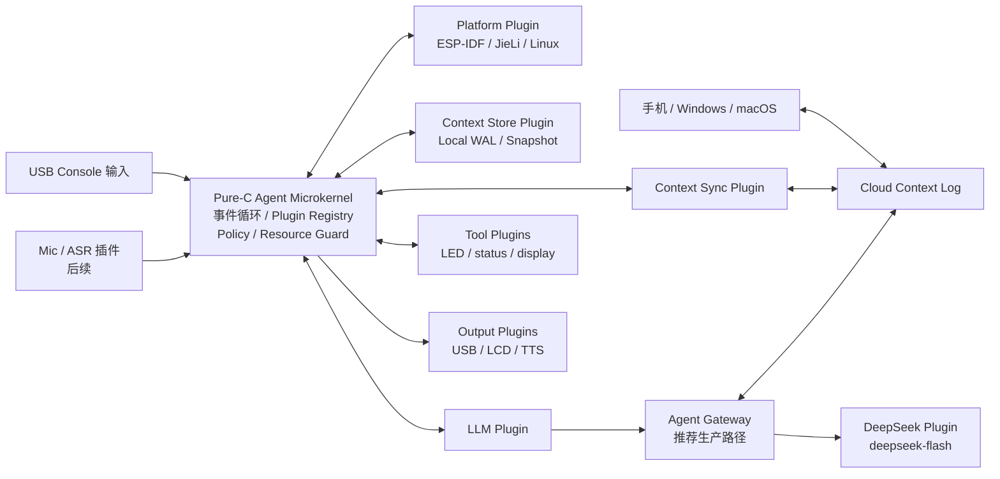
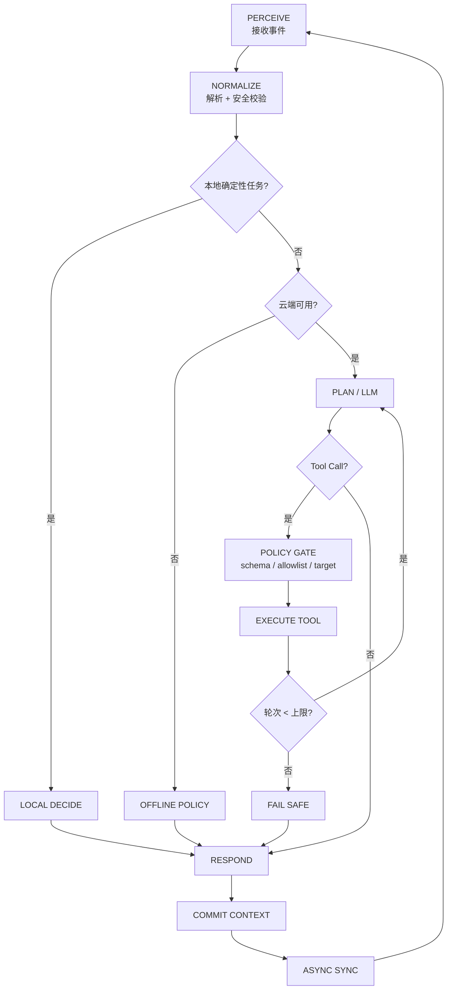

# ESP-Hi 纯 C 最简嵌入式 Agent 架构与完整实施方案

## 执行摘要

本方案的核心结论是：**不要直接把现有 `xiaozhi-esp32` 的 C++ Agent 框架“改成 C”**，而应该把它当成 ESP-Hi 的**硬件 BSP 参考实现**，重新建立一个极小的、纯 C11 的 Agent Microkernel。现有仓库当前已经是一个完整的 MCP/语音/显示/多板卡 C++ 工程，而且截至当前版本已要求 ESP-IDF 6.0.1 以上并推荐 ESP-IDF 6.1；ESP-Hi 板级配置明确指定 `esp32c3`、4 MB Flash。fileciteturn12file0L2-L2 fileciteturn3file0L2-L2

ESP-Hi 当前最重要的硬件约束不是计算能力，而是 **USB 与“身体舵机接口”存在资源冲突**：项目 README 明确说明，舵机控制占用了 ESP-Hi 的 USB Type-C 接口，因此连接电脑调试头部时应断开身体；代码又把 GPIO18、GPIO19 分配给身体相关控制，而 ESP32-C3 的 GPIO18/GPIO19 同时是原生 USB D-/D+。你的使用方式——**只接头部、USB 接电脑、不接身体**——恰好最适合做本方案的第一版 Agent：始终保留 USB Serial/JTAG，不初始化舵机部分。fileciteturn1file0L2-L2 fileciteturn2file0L2-L2 citeturn8view0turn8view1

ESP-Hi 的实际目标芯片是 ESP32-C3。ESP32-C3 是单核 32 位 RISC-V，最高 160 MHz，芯片具有 384 KB ROM、400 KB SRAM，其中部分 SRAM 用于 cache，并带原生 USB Serial/JTAG、Wi-Fi、BLE、UART、SPI、I²C、I²S、ADC、RMT 等外设。ESP-Hi 的项目配置进一步确认板上 Flash 为 4 MB。citeturn7view0 fileciteturn3file0L2-L2

因此，**DeepSeek-V4.1-Flash 绝不能、也没有必要加载到 ESP32-C3 Flash 中本地运行**。截至 2026 年 9 月 10 日，DeepSeek 官方 API 中应使用的模型字符串是 **`deepseek-flash`**，它当前对应 **DeepSeek-V4.1-Flash**；旧的 `deepseek-v4-flash` 已经下线，只是兼容别名并被路由到 V4.1-Flash。该模型具有最高 1M 上下文能力，支持思考/非思考、Tool Calls、JSON Output 等能力。这里的“1M 上下文”是云端模型能力，不意味着 ESP32-C3 应在本地组装 1M 上下文。citeturn26view0turn26view1

**ESP-Hi 第一版最简 Agent 应故意不做完整语音。** 虽然头部已经有麦克风、扬声器和屏幕，而且参考代码使用 16 kHz ADC 麦克风输入以及 24 kHz PDM 输出，但 DeepSeek 的这一接口是大模型 Chat/Tool API，而不是一个完整的 ASR+TTS 接口。第一阶段应使用：

**USB 文本输入 → Agent Core → Wi-Fi HTTPS → DeepSeek-V4.1-Flash → 流式文本回 USB → 可选调用 RGB LED 工具。**

这样最快验证 Agent 核心、插件 ABI、上下文同步、DeepSeek、Tool Calling、故障恢复全部关键路径。音频随后作为 `input.asr` 和 `output.tts` 插件增加，而不是侵入 Agent Core。ESP-Hi 原代码已经证明板上存在 ADC 麦克风、PDM 扬声器和 PA 控制电路。fileciteturn6file0L2-L2

最终建议的 MVP 是：

> **ESP-Hi Head Agent V0 = USB Console + Wi-Fi + DeepSeek Flash + LED Tool + 本地上下文日志 + 可切换云同步 + 静态插件系统。**

推荐把**混合上下文模式作为默认模式**。ESP-Hi、手机 App、Windows、macOS 将来全部视为同一个用户账号下的不同 `device_id`。每个客户端写入同一种 append-only context event；云端承担多设备 rendezvous 和合并，ESP-Hi 保留一个有限的本地事件日志和同步游标。这样即使 ESP-Hi 离线也可以继续记录本地状态，恢复网络后再同步。

整体实现应分成两类运行环境，但共享同一个 Agent ABI：

| 设计档位 | 工程假设 | Agent 插件方式 | 上下文 | LLM |
|---|---|---|---|---|
| **M0：ESP-Hi / 小型 MCU** | 实际 ESP-Hi 为 ESP32-C3、400 KB SRAM、4 MB Flash、Wi-Fi。citeturn7view0 fileciteturn3file0L2-L2 | 编译期静态插件表 | NVS + 独立 Flash 日志分区 | DeepSeek HTTPS / Gateway；不运行本地 LLM |
| **M1：较强 MCU** | 工程适配档位，例如带更多 SRAM/PSRAM/Flash 的 ESP32-S3、Cortex-M33/M7 等；具体容量必须根据产品确认 | 仍优先静态插件 | Flash 文件系统/裸日志 + 云 | 云 LLM，可增加小型 intent/NN 插件 |
| **L0：Embedded Linux/OpenWrt** | 内存、Flash、CPU、发行版均由具体厂商 SDK 决定 | 静态 + 可选 `.so` 动态插件 | SQLite/文件/WAL + 云 | DeepSeek、厂商 LLM，资源足够时可增加本地模型 |

OpenWrt 本身定位为面向嵌入式设备的 Linux，并提供软件包构建/交叉编译体系；其官方仓库的标准构建流程包括 feeds 更新、安装、`make menuconfig` 和交叉编译。因此 Agent Core 不应依赖 FreeRTOS 或 POSIX，而应把 OS 能力全部置于 `platform_ops` 后面。fileciteturn14file0L2-L2

**思考模式建议也应分成两个层次。**

对 ESP-Hi 上的 DeepSeek Agent，第一版明确发送：

```json
"thinking": {
  "type": "disabled"
}
```

并使用：

```json
"stream": true
```

原因不是模型能力不够，而是 ESP32-C3 RAM 很小，而且 DeepSeek 官方明确要求：**当开启思考并带 `tools` 时，后续请求必须完整回传历史 `reasoning_content`，否则会返回 400**。因此直接从 ESP-Hi 做 Tool Calling 时，V0 使用**非思考模式 + Tool Calling**最合适；复杂任务以后交给云 Gateway，在 Gateway 上开启 `thinking=enabled`、`reasoning_effort=high`。citeturn26view2

对 **Codex 实施本项目**，建议第一次先用 **Plan Mode + High reasoning** 做仓库/BSP/硬件调查，然后进入执行模式；当前 Codex 配置正式支持 `model_reasoning_effort = minimal | low | medium | high | xhigh`，并存在独立的 `plan_mode_reasoning_effort`。citeturn35view0turn35view1

Codex 权限建议采用：

**开发、自动下载依赖：`Approve for me / Auto-review` + workspace 权限 + 允许必要网络访问；真正执行 `idf.py flash` 时切换为 `Ask for approval`。不要为这个项目使用 Full access，更不要授权 Codex 自动烧写 eFuse。** 官方文档明确指出，Full access 能够访问更广的本机文件并运行网络命令，风险明显高于 workspace 模式；Codex 的 sandbox 与 approval policy 是两个独立安全层。citeturn20search1turn20search3turn20search4

## ESP-Hi 硬件分析与目标平台边界

ESP-Hi 官方开源硬件页面目前对自动页面抓取返回 403，因此无法在本次研究中直接机器读取完整原理图/PCB 数据；硬件事实主要通过 ESP-Hi 官方项目摘要、ESP32-C3 官方资料以及 `xiaozhi-esp32` 中 ESP-Hi BSP 三方交叉验证。最终量产前，仍然应利用嘉立创 EDA 对原理图/PCB 做一次自动比对。citeturn31view0

ESP-Hi 的现有 BSP 已经给出了非常完整的引脚事实：麦克风 ADC channel 2、PDM 扬声器 GPIO6/7、PA 控制 GPIO3、BOOT GPIO9、动作/音频按键 GPIO0/1、LCD GPIO4/5/10，以及身体控制 GPIO18/19/20/21。fileciteturn2file0L2-L2

| 子系统 | 已确认配置 | ESP-Hi Agent V0 用法 | 需要特别注意的地方 |
|---|---|---|---|
| MCU | ESP32-C3；单核 RISC-V，最高 160 MHz；400 KB SRAM。citeturn7view0 | Agent Core、Wi-Fi、TLS、USB CLI | 按**无 PSRAM**设计；项目配置并未声明可依赖 PSRAM |
| Flash | BSP 配置明确为 4 MB。fileciteturn3file0L2-L2 | Firmware + context partition | 不得缓存大型模型 |
| 现有分区 | `factory=0x2F0000`，`assets=0x100000`，另有 NVS/OTA data/PHY。fileciteturn11file0L2-L2 | V0 可把原 `assets` 的 1 MB 空间重新设计为 `ctx` | 新 Agent 与原 xiaozhi 固件不是同一个镜像，必须单独维护分区表 |
| Wi-Fi | ESP32-C3 具备 2.4 GHz Wi-Fi；原 ESP-Hi 继承 `WifiBoard` 并使用 Wi-Fi 事件。citeturn7view0 fileciteturn4file0L2-L2 | DeepSeek/Gateway、context sync | 网络断开不得阻塞 Agent 主循环 |
| USB | ESP32-C3 原生 USB Serial/JTAG 使用 GPIO18/GPIO19。citeturn8view0turn8view1 | **主开发 CLI、烧录、日志** | V0 禁止初始化身体/Servo |
| BOOT | GPIO9。fileciteturn2file0L2-L2 | BOOT/进入下载模式 | GPIO9 是 ESP32-C3 strap pin；原项目说明可按住 BOOT 再连接电脑进入下载。citeturn8view3 fileciteturn1file0L2-L2 |
| Move/Awake 按键 | GPIO0 / GPIO1。fileciteturn2file0L2-L2 | 可在后续作为 Agent wake/cancel | V0 可不启用，减少变量 |
| RGB LED | 原 BSP 在 GPIO8 上配置 4 个 WS2812，RMT 驱动。fileciteturn4file0L2-L2 | 第一版最有价值的 Tool 输出 | GPIO8 同时属于 C3 strap 相关引脚，应在启动完成后才初始化，硬件上下拉最终由 EDA 检查 |
| LCD | 160×80；MOSI GPIO4、CLK GPIO5、DC GPIO10；CS/RST 未连接；参考实现 SPI 40 MHz。fileciteturn2file0L2-L2 fileciteturn5file0L2-L2 | V0.1 加入状态显示 | `config.h` 标为 ST7789 serial，而实际初始化代码通过 ILI9341 API 加自定义初始化表，**具体控制器型号必须通过原理图/BOM确认** |
| 麦克风 | ADC Mic Channel 2；16 kHz；12-bit ADC continuous。fileciteturn2file0L2-L2 fileciteturn6file0L2-L2 | V1 ASR 插件 | ESP32-C3 ADC1_CH2 映射到 GPIO2。citeturn8view0 |
| 音频输出 | 24 kHz、16-bit mono PDM；GPIO6 正相信号，GPIO7 反相信号；PA GPIO3。fileciteturn2file0L2-L2 fileciteturn6file0L2-L2 | V1 TTS 插件 | V0 不初始化，先释放 I2S/RAM/任务资源 |
| 身体接口 | 原 BSP：FL GPIO21、FR GPIO19、BL GPIO20、BR GPIO18。fileciteturn2file0L2-L2 | **全部禁用** | GPIO18/19 与 USB D-/D+ 冲突，这是你当前“只用头部”的关键配置 |
| Web 控制 | 原 BSP 可在 Wi-Fi 连接后启动 Web Control，README 给出同网段 Web UI。fileciteturn1file0L2-L2 fileciteturn4file0L2-L2 | V2 可加入本地 WebSocket/Web UI | 云同步是主通道，本地 Web UI 不作为 V0 必选 |
| 电源 | 开源项目描述显示头部由 USB Type-C 供电，使用 3.3 V 稳压，并特别考虑 Wi-Fi 电流脉动对音频部分的影响。citeturn4search1 | USB 给头部供电即可 | 具体板版号、稳压器料号/最大电流仍应通过 EDA 核实 |

特别值得强调的是，当前 `config.json` 同时列出了 USB Serial/JTAG 与 `CONFIG_ESP_CONSOLE_NONE` 相关配置，而参考代码又用 `CONFIG_ESP_CONSOLE_NONE` 来决定是否初始化身体控制。不能简单假定这两个选项在最终生成的 `sdkconfig` 中会按文本列表同时发挥作用。新纯 C Agent 不应该复制这种兼容逻辑，而应该直接采用：

```text
HEAD_ONLY=1
USB_SERIAL_JTAG=1
BODY_SERVO=0
```

这一配置决策来自你的实际使用场景，而不是继续兼容机器人身体。原项目本身也明确指出 PC 调试与身体 Servo 存在 USB 冲突。fileciteturn3file0L2-L2 fileciteturn1file0L2-L2

**V0 建议的 Flash 划分**可以直接借鉴现有 4 MB 表的空间比例，但删除 `assets` 概念：

```csv
# Name,     Type, SubType, Offset,  Size
nvs,        data, nvs,     0x9000,  0x6000
phy_init,   data, phy,              0x1000
factory,    app,  factory,          0x290000
ctx,        data, spiffs,           0x100000
```

这只是建议起点，实际 offset 应由 Codex 运行 ESP-IDF partition-table 工具重新验证，不能手工假定地址无重叠。现有 xiaozhi 的 4 MB 表已经证明约 3 MB app + 1 MB data 的布局在这块板的 4 MB Flash 空间中是可行的。fileciteturn11file0L2-L2

针对尚未指定的其他 MCU/Linux 产品，不应该把 ESP-IDF API直接放到 Agent Core 中。建议定义三个工程能力档：

| 能力档 | RAM/存储工程预算 | 网络能力假设 | 适配策略 |
|---|---:|---|---|
| `MCU_TINY` | RAM 约 256–512 KB，Flash 2–4 MB | Wi-Fi/蜂窝 SDK 或网关连接 | 固定 arena、静态插件、无本地 LLM、上下文滚动日志 |
| `MCU_EXTENDED` | RAM/PSRAM 约 1–8 MB，Flash 8–32 MB | Wi-Fi/Ethernet | 可增大 JSON/Context window，可装 TinyML/Intent 插件 |
| `LINUX_EDGE` | RAM ≥几十 MB、文件系统可写 | TCP/IP/POSIX | SQLite/WAL、`.so` 插件、完整 TLS/HTTP client，可选本地模型 |

以上是**软件设计档位而不是对“乐鑫/杰里/OpenWrt 所有产品”的硬件事实假设**。真正适配杰里等厂商 SDK 时，Agent Core 不变，只实现 `platform/jieli/`；未指定具体杰里芯片、SDK 版本和编译器前，不应该虚构具体下载地址或工具链名称。

## 软件架构、插件契约与 Agent 推理运行模式

这个 Agent 最适合采用“**微内核 + 一切皆插件**”而不是“大应用拆模块”。

真正不能插件化的只有非常小的一层：

```text
Agent Kernel
 ├── Event Loop
 ├── Plugin Registry
 ├── Message/Event ABI
 ├── Resource Budget
 └── Policy/Safety Gate
```

其他东西全部通过插件：

```text
platform / transport / llm / context_store / context_sync
input / output / tool / auth / telemetry / model_runtime
```

整体结构建议如下：



**为什么不让每个插件随便调用 ESP-IDF？**

因为将来你的目标至少包括：

```text
ESP32-C3
ESP32-S3/其他乐鑫
杰里 MCU
其他厂商 RTOS
OpenWrt
普通 Embedded Linux
Windows/macOS companion app
```

所以所有与操作系统相关的功能应该收缩为：

```c
typedef struct agent_platform_ops_v1 {
    uint32_t abi_version;

    uint64_t (*monotonic_ms)(void);
    int      (*random_bytes)(void *buf, size_t len);

    void    *(*alloc)(size_t size);
    void     (*free)(void *ptr);

    int (*kv_get)(const char *ns,
                  const char *key,
                  void *buf,
                  size_t *inout_len);

    int (*kv_set)(const char *ns,
                  const char *key,
                  const void *buf,
                  size_t len);

    int (*reboot)(void);

    void (*log)(int level,
                const char *module,
                const char *message);
} agent_platform_ops_v1_t;
```

网络则再独立成 transport plugin，不要把 socket、lwIP、libcurl 或 ESP HTTP Client 放进 Core。

**推荐的基本插件 ABI：**

```c
typedef enum {
    AGENT_PLUGIN_PLATFORM = 1,
    AGENT_PLUGIN_TRANSPORT,
    AGENT_PLUGIN_LLM,
    AGENT_PLUGIN_CONTEXT_STORE,
    AGENT_PLUGIN_CONTEXT_SYNC,
    AGENT_PLUGIN_INPUT,
    AGENT_PLUGIN_OUTPUT,
    AGENT_PLUGIN_TOOL,
    AGENT_PLUGIN_AUTH,
    AGENT_PLUGIN_TELEMETRY,
    AGENT_PLUGIN_MODEL_RUNTIME
} agent_plugin_kind_t;

typedef struct agent_host_v1 agent_host_v1_t;

typedef struct agent_plugin_v1 {
    uint16_t abi_major;
    uint16_t abi_minor;
    uint32_t struct_size;

    agent_plugin_kind_t kind;

    const char *name;
    const char *vendor;
    const char *version;

    uint64_t capabilities;

    int (*init)(
        const agent_host_v1_t *host,
        const void *config,
        void **plugin_ctx);

    int (*start)(void *plugin_ctx);

    int (*handle_event)(
        void *plugin_ctx,
        const void *event);

    void (*stop)(void *plugin_ctx);
    void (*deinit)(void *plugin_ctx);
} agent_plugin_v1_t;
```

为了兼容 MCU，**V0 不做运行时 ELF/动态库加载**。插件通过 CMake 或构建脚本生成：

```c
extern const agent_plugin_v1_t g_platform_espidf;
extern const agent_plugin_v1_t g_llm_deepseek;
extern const agent_plugin_v1_t g_context_spiffs;
extern const agent_plugin_v1_t g_tool_led;
extern const agent_plugin_v1_t g_output_usb;

const agent_plugin_v1_t *g_agent_plugins[] = {
    &g_platform_espidf,
    &g_llm_deepseek,
    &g_context_spiffs,
    &g_tool_led,
    &g_output_usb,
};
```

Embedded Linux 则在保持相同 ABI 的基础上增加可选：

```c
void *h = dlopen("/usr/lib/edge-agent/plugins/llm_xxx.so", RTLD_NOW);
agent_plugin_get_v1_fn get_plugin =
    dlsym(h, "agent_plugin_get_v1");
```

这样**“插件”是架构概念，不等于 MCU 上必须支持动态 `.so`。**

主要插件契约建议如下：

| 插件类型 | 核心 API | ESP-Hi 实现 | Linux 实现 |
|---|---|---|---|
| Platform | time/random/KV/memory/reboot/log | ESP-IDF | POSIX |
| Transport | connect/request/read/write/close | `esp_http_client` / ESP-TLS | libcurl/mbedTLS/厂商库 |
| LLM | complete/stream/cancel/tool continuation | `deepseek_http` 或 `gateway_llm` | DeepSeek/其他厂商/本地模型 |
| Context Store | append/read/snapshot/compact | SPIFFS + NVS | SQLite/WAL 或文件 |
| Context Sync | push/pull/ack | HTTPS | HTTPS/WebSocket |
| Input | open/read/close | USB console；以后 ADC/ASR | stdin/socket/audio |
| Output | write/status | USB、LED、以后 LCD/PDM | stdout/UI/audio |
| Tool | describe/invoke | `light.set_rgb`, `system.info` | shell-free system tools |
| Auth | token_get/refresh/sign | NVS/device credential | Keychain/file/KMS |
| Model Runtime | probe/load/infer/unload | Tiny model only | vendor NPU/CPU runtime |

LLM 插件本身建议再定义一个供应商无关契约：

```c
typedef enum {
    AGENT_THINKING_OFF = 0,
    AGENT_THINKING_LOW,
    AGENT_THINKING_HIGH,
    AGENT_THINKING_MAX
} agent_thinking_t;

typedef struct {
    const char *model;

    const void *messages;
    size_t message_count;

    const void *tools;
    size_t tool_count;

    agent_thinking_t thinking;

    bool stream;

    size_t max_request_bytes;
} agent_llm_request_t;

typedef enum {
    AGENT_LLM_EVENT_REASONING,
    AGENT_LLM_EVENT_TEXT,
    AGENT_LLM_EVENT_TOOL_BEGIN,
    AGENT_LLM_EVENT_TOOL_ARGUMENT_DELTA,
    AGENT_LLM_EVENT_TOOL_END,
    AGENT_LLM_EVENT_DONE,
    AGENT_LLM_EVENT_ERROR
} agent_llm_event_type_t;
```

从而 DeepSeek、Qwen、OpenAI、厂商自研模型都只是：

```text
agent_llm_ops_v1
    ├─ deepseek_http
    ├─ qwen_http
    ├─ vendor_x_http
    ├─ gateway_llm
    └─ local_runtime
```

### Agent 自身思考/运行循环

建议不要把“Agent”理解成“无限循环调用大模型”。嵌入式设备应该严格执行：



即：

> **感知 → 归一化 → 决策 → 计划 → 安全门 → 执行 → 观察 → 上下文提交 → 同步。**

这里所谓“学习”第一阶段不是让 MCU 在线训练模型，而是：

```text
对话历史
用户偏好
设备状态
工具执行结果
摘要
错误统计
```

进入 Context Store，之后再次作为 Agent 输入。

ESP-Hi 上建议采用三档推理策略：

| 场景 | 推理策略 |
|---|---|
| `/status`、LED 命令、Wi-Fi 配置 | 完全本地，不调用 LLM |
| 普通问答、简单 Tool Calling | `deepseek-flash` + `thinking disabled` + stream |
| 多步骤规划 | 优先 Gateway；`thinking enabled` + `reasoning_effort=high` |
| 网络不可用 | 本地命令 + 缓存状态；自然语言返回 offline 响应 |
| `max` thinking | 只给诊断/极复杂任务使用，不作为 ESP-Hi 默认 |

DeepSeek 当前默认思考模式是开启、默认 effort 为 `high`；因此 ESP-Hi V0 必须**主动发送 disabled**，而不能依赖默认值。citeturn26view2

Tool 执行必须有本地安全门。第一版只注册：

```text
device.status.get
device.light.get
device.light.set_rgb
agent.context.stats
```

绝不提供：

```text
shell.exec
gpio.write_arbitrary
flash.erase
efuse.burn
firmware.write_raw
```

即使 LLM 请求这些工具，也不存在相应插件。

故障恢复采用：

```text
HTTP timeout
    ↓
重试一次
    ↓
exponential backoff + jitter
    ↓
circuit breaker
    ↓
切换 offline local policy
```

Context event **先本地 WAL 提交，再尝试同步**，这样掉电、Wi-Fi 中断和云端故障都不会破坏对话事件顺序。

### “离线模型/Flash 模型”应如何定义

建议定义通用 Model Runtime 插件，但不要把它和 DeepSeek-V4.1-Flash 混为一谈。

ESP-Hi 4 MB Flash、400 KB SRAM 与 DeepSeek 云模型的规模根本不在同一数量级，因此在 ESP-Hi 上“离线 Flash 模型”应指：

```text
wake word
intent classifier
tiny embedding model
tiny anomaly classifier
规则/有限状态策略
```

而不是 DeepSeek-V4.1。这个结论由 ESP32-C3 的本地资源规模和 DeepSeek V4.1 的云 API 产品形态共同决定。citeturn7view0turn26view0turn26view1

可预留如下镜像头：

```c
typedef struct {
    uint32_t magic;
    uint16_t format_version;
    uint16_t model_type;

    uint32_t payload_size;
    uint32_t required_ram;

    uint8_t sha256[32];

    char provider[16];
    char model_name[32];
    char model_version[16];
} agent_model_header_t;
```

加载顺序：

```text
读取 manifest
→ 检查 magic/version
→ 检查 MCU capability
→ SHA-256 校验
→ 检查 required_ram
→ model_runtime.load()
→ infer()
```

Linux 平台可使用同样插件接口，只把 Flash partition 替换成文件和 `mmap()`/厂商 Runtime。

## DeepSeek-V4.1-Flash 对接设计与 C 语言实现

截至 2026 年 9 月 10 日，DeepSeek 官方给出的 OpenAI-compatible Base URL 为：

```text
https://api.deepseek.com
```

Chat API 示例端点为：

```text
https://api.deepseek.com/chat/completions
```

认证：

```http
Authorization: Bearer ${DEEPSEEK_API_KEY}
Content-Type: application/json
```

模型字段必须使用：

```json
"model": "deepseek-flash"
```

当前它对应 DeepSeek-V4.1-Flash。官方同时说明旧 `deepseek-v4-flash` 虽仍可调用，但原模型已经下线，会被路由到 V4.1-Flash，因此新代码不应再使用旧名字。citeturn26view0turn26view1

DeepSeek 当前能力与 Agent 的映射为：

| DeepSeek 能力 | ESP-Hi 使用方式 |
|---|---|
| 非思考模式 | **ESP-Hi V0 默认** |
| 思考模式 | Gateway / 高复杂度任务 |
| Streaming | **V0 默认**，降低等待感和 RAM 峰值 |
| Non-streaming | bring-up 与 API 单元测试 |
| Tool Calls | LED、status 等插件 |
| JSON Output | 云端结构化任务 |
| 1M context | Gateway 负责利用，ESP-Hi 不直接组装 1M |
| `reasoning_content` | V0 thinking-off 不需要；thinking+tools 时必须正确回传 |

这些能力和当前模型规格均由 DeepSeek 官方文档明确列出。citeturn26view1turn26view2

### Direct 与 Gateway 两种模式

必须同时支持：

```text
DEEPSEEK_ROUTE_DIRECT
DEEPSEEK_ROUTE_GATEWAY
```

开发阶段最简单：

```text
ESP-Hi
  → HTTPS
  → api.deepseek.com
```

生产阶段推荐：

```text
ESP-Hi
  → HTTPS + device credential
  → 你的 Agent Gateway
      ├→ Context Service
      └→ DeepSeek API
```

原因主要有三个：

第一，DeepSeek 原始 API key 不应该长期放在可物理接触的嵌入式设备中。

第二，Gateway 可以拿 `session_id + context cursor` 自己组装长上下文，而 ESP32-C3 只上传本轮内容，显著降低 MCU RAM。

第三，手机、PC、ESP-Hi 可以通过同一个 Gateway 共享上下文。

ESP-IDF 官方 `esp_http_client` 支持 HTTP/S、TLS、事件回调、持久连接和主动流式读写；HTTPS 可以利用 x509 CA bundle 做服务器证书验证，非常适合实现这里的 C transport plugin。citeturn24view0

### C 语言 DeepSeek 请求骨架

下面是 ESP-IDF 方向的最小骨架。真正项目应把它放到：

```text
plugins/llm/deepseek/
```

而不是 `app_main.c`。

```c
#include <stdio.h>
#include <stdlib.h>
#include <string.h>

#include "esp_err.h"
#include "esp_http_client.h"
#include "esp_crt_bundle.h"
#include "esp_log.h"
#include "cJSON.h"

#define DS_URL "https://api.deepseek.com/chat/completions"

static const char *TAG = "deepseek";

/*
 * 正式实现：
 * - 禁止把 key 编译到 firmware。
 * - 此函数从 Secret/Auth plugin 获取。
 */
extern int agent_secret_get(const char *name,
                            char *out,
                            size_t out_len);

/*
 * 流式模式不要假定一次 HTTP_EVENT_ON_DATA 就是一条 JSON。
 * TCP/HTTP chunk 可以在任意字节处切分。
 */
extern void deepseek_stream_feed(const uint8_t *data,
                                 size_t len);

typedef struct {
    char   *buf;
    size_t used;
    size_t capacity;
    bool   streaming;
} ds_http_ctx_t;

static esp_err_t ds_http_event(esp_http_client_event_t *evt)
{
    ds_http_ctx_t *ctx = (ds_http_ctx_t *)evt->user_data;

    if (!ctx) {
        return ESP_OK;
    }

    switch (evt->event_id) {
    case HTTP_EVENT_ON_DATA:
        if (ctx->streaming) {
            deepseek_stream_feed(
                (const uint8_t *)evt->data,
                (size_t)evt->data_len
            );
            return ESP_OK;
        }

        if (ctx->buf &&
            ctx->used + (size_t)evt->data_len + 1 < ctx->capacity) {
            memcpy(ctx->buf + ctx->used,
                   evt->data,
                   (size_t)evt->data_len);

            ctx->used += (size_t)evt->data_len;
            ctx->buf[ctx->used] = '\0';
        } else {
            ESP_LOGE(TAG, "HTTP response exceeds local buffer");
            return ESP_ERR_NO_MEM;
        }
        break;

    default:
        break;
    }

    return ESP_OK;
}

static char *build_request_json(const char *user_text,
                                bool streaming)
{
    cJSON *root = cJSON_CreateObject();
    cJSON *messages = cJSON_CreateArray();
    cJSON *system_msg = cJSON_CreateObject();
    cJSON *user_msg = cJSON_CreateObject();
    cJSON *thinking = cJSON_CreateObject();

    if (!root || !messages || !system_msg ||
        !user_msg || !thinking) {
        goto fail;
    }

    cJSON_AddStringToObject(root, "model", "deepseek-flash");

    /* ESP-Hi V0 明确关闭 thinking */
    cJSON_AddStringToObject(thinking, "type", "disabled");
    cJSON_AddItemToObject(root, "thinking", thinking);
    thinking = NULL;

    cJSON_AddBoolToObject(root, "stream", streaming);

    cJSON_AddStringToObject(system_msg, "role", "system");
    cJSON_AddStringToObject(
        system_msg,
        "content",
        "You are the language model of a small embedded agent. "
        "Use tools only when required."
    );

    cJSON_AddStringToObject(user_msg, "role", "user");
    cJSON_AddStringToObject(user_msg, "content", user_text);

    cJSON_AddItemToArray(messages, system_msg);
    system_msg = NULL;

    cJSON_AddItemToArray(messages, user_msg);
    user_msg = NULL;

    cJSON_AddItemToObject(root, "messages", messages);
    messages = NULL;

    char *json = cJSON_PrintUnformatted(root);
    cJSON_Delete(root);
    return json;

fail:
    cJSON_Delete(thinking);
    cJSON_Delete(system_msg);
    cJSON_Delete(user_msg);
    cJSON_Delete(messages);
    cJSON_Delete(root);
    return NULL;
}

esp_err_t deepseek_request(const char *user_text,
                           bool streaming,
                           char *response,
                           size_t response_capacity)
{
    if (!user_text) {
        return ESP_ERR_INVALID_ARG;
    }

    char key[192] = {0};

    if (agent_secret_get("deepseek_api_key",
                         key,
                         sizeof(key)) != 0) {
        ESP_LOGE(TAG, "DeepSeek API key unavailable");
        return ESP_ERR_INVALID_STATE;
    }

    char *body = build_request_json(user_text, streaming);
    if (!body) {
        memset(key, 0, sizeof(key));
        return ESP_ERR_NO_MEM;
    }

    char auth[224] = {0};
    int n = snprintf(auth, sizeof(auth), "Bearer %s", key);

    /*
     * 尽早擦除独立 key buffer。
     * auth 在请求结束后同样擦除。
     */
    memset(key, 0, sizeof(key));

    if (n <= 0 || (size_t)n >= sizeof(auth)) {
        cJSON_free(body);
        memset(auth, 0, sizeof(auth));
        return ESP_ERR_INVALID_SIZE;
    }

    ds_http_ctx_t http_ctx = {
        .buf = response,
        .used = 0,
        .capacity = response_capacity,
        .streaming = streaming,
    };

    esp_http_client_config_t cfg = {
        .url = DS_URL,
        .event_handler = ds_http_event,
        .user_data = &http_ctx,
        .crt_bundle_attach = esp_crt_bundle_attach,
        .timeout_ms = 30000,
    };

    esp_http_client_handle_t client =
        esp_http_client_init(&cfg);

    if (!client) {
        cJSON_free(body);
        memset(auth, 0, sizeof(auth));
        return ESP_FAIL;
    }

    esp_http_client_set_method(
        client,
        HTTP_METHOD_POST
    );

    esp_http_client_set_header(
        client,
        "Content-Type",
        "application/json"
    );

    esp_http_client_set_header(
        client,
        "Authorization",
        auth
    );

    esp_http_client_set_post_field(
        client,
        body,
        (int)strlen(body)
    );

    esp_err_t err = esp_http_client_perform(client);

    if (err == ESP_OK) {
        int status = esp_http_client_get_status_code(client);

        if (status < 200 || status >= 300) {
            ESP_LOGE(TAG, "DeepSeek HTTP status=%d", status);
            err = ESP_FAIL;
        }
    }

    esp_http_client_cleanup(client);

    cJSON_free(body);
    memset(auth, 0, sizeof(auth));

    return err;
}
```

ESP-IDF 官方说明 `esp_http_client_perform()` 可以执行完整 HTTPS 事务，HTTP client 支持事件回调；对于主动 streaming 也提供 `open/write/fetch_headers/read` 等接口。HTTPS 应使用服务器证书校验或官方证书 bundle，而不能为了方便关闭 TLS verification。citeturn24view0

流解析器必须做成一个真正的增量状态机：

```text
TCP bytes
  ↓
HTTP data callback
  ↓
SSE/stream framing accumulator
  ↓
JSON object parser
  ↓
choices[].delta
  ├─ reasoning_content
  ├─ content
  └─ tool_calls[]
  ↓
normalized agent_llm_event_t
```

绝不能写成：

```c
// 错误设计
cJSON_Parse(evt->data);
```

因为 `evt->data` 只是本次 HTTP callback 的字节段，并不保证正好等于一个完整 JSON object。ESP HTTP Client 的流式接口本身也明确按字节流读写，而不是按应用层 JSON 消息边界工作。citeturn24view0

建议对 MCU 设置内部保护：

```text
request_body_limit       = 24 KiB
single_stream_line_limit = 6 KiB
tool_arguments_limit     = 4 KiB
tool_round_limit         = 4
response_display_ring    = 8 KiB
```

这些数字是本方案的**工程预算起点**，不是 DeepSeek API 限制；Codex 后续应根据 `idf.py size`、运行时 minimum free heap 和真实请求重新调整。

### Tool Calling

DeepSeek 官方支持 Tool Calls，并支持思考模式下的多轮 Tool Calling。citeturn26view1turn26view2

ESP-Hi 发送给模型的 Tool schema 可以先只有：

```json
{
  "type": "function",
  "function": {
    "name": "device_light_set_rgb",
    "description": "Set ESP-Hi head RGB light color.",
    "parameters": {
      "type": "object",
      "properties": {
        "r": { "type": "integer", "minimum": 0, "maximum": 255 },
        "g": { "type": "integer", "minimum": 0, "maximum": 255 },
        "b": { "type": "integer", "minimum": 0, "maximum": 255 }
      },
      "required": ["r", "g", "b"]
    }
  }
}
```

原 ESP-Hi BSP 已经实现过 `self.light.set_rgb`、开灯/关灯工具，证明 GPIO8 上这组 RGB LED 是适合作为首个 Agent Tool 的硬件。fileciteturn5file0L2-L2

但是新纯 C Agent 不复制原来的 MCP C++ 类；只重新实现：

```c
typedef int (*agent_tool_invoke_fn)(
    const char *arguments_json,
    char *result_json,
    size_t result_capacity
);
```

Tool dispatcher 顺序固定为：

```text
模型输出 tool name
→ 查本地注册表
→ 检查 tool 是否存在
→ JSON schema validation
→ permission/capability check
→ 参数范围检查
→ timeout
→ invoke
→ 结果写入 context
→ 再交回模型
```

对于 Thinking + Tool Calling，DeepSeek 官方要求完整保留并回传 `reasoning_content`；遗漏会导致 400。因此 ESP-Hi V0 不启用这一组合。以后 Gateway 执行复杂 Tool loop 时，`reasoning_content` 只作为本轮协议状态保存，不应默认作为长期用户记忆同步。citeturn26view2

### API key 保存

开发机上可以：

```text
DEEPSEEK_API_KEY
```

作为 host 环境变量，然后通过一个**不会回显 key 的 provisioning 命令**写入设备的 Secret Store。

不要：

```c
#define DEEPSEEK_KEY "sk-xxxxx"
```

也不要提交：

```text
sdkconfig
secrets.h
keys.json
```

到 Git。

ESP32-C3 的 ESP-IDF 支持 NVS Encryption；官方说明 NVS 内容可使用 XTS-AES 加密，并支持基于 Flash Encryption 或 HMAC/eFuse 派生方案。citeturn25view0

但**开发早期不要让 Codex自动烧安全 eFuse**。ESP-IDF 官方明确警告 Flash Encryption 会影响后续更新方式，并要求生产环境理解 release mode 的后果。citeturn25view1

因此分三阶段：

```text
DEV
API key → NVS
设备仅作开发用途

PILOT
API key → encrypted NVS
Flash encryption development mode

PRODUCTION
设备完全不存 DeepSeek API key
只存 device credential
→ Gateway
→ Gateway 保存 DeepSeek key
```

## 本地、云端和混合上下文同步设计

上下文不能设计成：

```text
messages[]
```

就结束。

如果未来同一用户同时拥有：

```text
ESP-Hi
手机 App
Windows PC
macOS
第二台嵌入式设备
```

那么真正需要的是一个**多设备事件日志**。

建议把上下文定义为：

> **不可变 Context Event + 可重建 Snapshot。**

三种模式保持同一个 API：

| 模式 | 本地持久化 | 云持久化 | 离线 | 手机/PC共享 |
|---|---|---|---|---|
| Local | 完整 | 无 | 最强 | 仅未来 LAN peer |
| Cloud | 只保留 retry queue/cursor | 完整 | 弱 | 强 |
| Hybrid | **完整或有限本地日志** | **完整/摘要云日志** | 强 | **强，推荐** |

### 统一 Context Event

云端使用 JSON，ESP-Hi V0 本地也先用同一个 JSON schema，等稳定以后再把本地 payload 替换成 CBOR。

示例：

```json
{
  "schema": "agent.context.event/1",

  "event_id": "esp-hi-a1b2:0000000042",
  "device_id": "esp-hi-a1b2",
  "user_id": "user-001",
  "session_id": "home-assistant-01",

  "device_seq": 42,
  "lamport": 173,

  "type": "message",

  "actor": {
    "type": "user"
  },

  "content": {
    "format": "text/plain",
    "text": "把灯改成暖一点"
  },

  "policy": {
    "sync": true,
    "sensitive": false,
    "ttl": 0
  },

  "parents": [
    "pc-6631:0000000881"
  ]
}
```

工具事件：

```json
{
  "schema": "agent.context.event/1",
  "event_id": "esp-hi-a1b2:0000000043",
  "device_id": "esp-hi-a1b2",
  "session_id": "home-assistant-01",
  "device_seq": 43,
  "lamport": 174,

  "type": "tool_result",

  "content": {
    "tool": "device.light.set_rgb",
    "call_id": "call-7",
    "result": {
      "ok": true,
      "r": 255,
      "g": 120,
      "b": 60
    }
  }
}
```

本地物理记录不要单纯写 JSONL；为掉电恢复增加帧头：

```text
┌────────┬─────┬───────┬──────────┬──────────┬──────────┐
│ magic  │ ver │ flags │ seq      │ length   │ payload  │
│ 4B     │ 2B  │ 2B    │ 8B       │ 4B       │ N bytes  │
└────────┴─────┴───────┴──────────┴──────────┴──────────┘
                                                   │
                                                   ▼
                                                CRC32
```

启动扫描时：

```text
从分区开头扫描
→ frame header
→ length sanity check
→ CRC
→ 最后一条损坏记录丢弃
→ 恢复 write pointer
```

从而突然拔 USB 电源最多损失正在写的一条记录。

### 多设备同步算法

不建议 V0 上一个完整通用 CRDT 库，因为对 ESP32-C3 过重。

一个简单、确定、足够可靠的方案是：

```text
event_id = device_id + device_seq
```

并维护：

```text
device_seq
lamport_clock
cloud_cursor
last_acked_seq
```

本地新事件：

```text
local_lamport++
append WAL
enqueue sync
```

收到远端事件：

```text
local_lamport =
    max(local_lamport, remote_lamport) + 1
```

服务端 deduplicate：

```text
UNIQUE(event_id)
```

聊天消息是 append-only，不产生覆盖冲突。

对于：

```text
user.preference.*
memory.fact.*
device.alias
```

等可变 key，则按：

```text
(lamport, device_id)
```

进行确定性 LWW。

删除使用 tombstone，而不是立即物理删除。

同步 API 可以定义：

```http
POST /v1/context/events:batch
GET  /v1/context/events?cursor=xxxxx
POST /v1/context/ack
```

ESP-Hi 请求：

```json
{
  "device_id": "esp-hi-a1b2",
  "cursor": "cloud-91823",
  "events": [
    {
      "...": "..."
    }
  ]
}
```

返回：

```json
{
  "ack": {
    "device_seq": 43
  },
  "cursor": "cloud-91827",
  "remote_events": []
}
```

### 推荐的 Gateway turn 协议

这一步对小 MCU 非常重要。

不要让 ESP-Hi 每轮都发送几十 KB 历史：

```text
ESP-Hi:
messages[100]
→ DeepSeek
```

而改为：

```json
POST /v1/agent/turns

{
  "user_id": "user-001",
  "device_id": "esp-hi-a1b2",
  "session_id": "home-assistant-01",
  "context_cursor": "cloud-91827",

  "input": {
    "type": "text",
    "text": "我刚才在电脑上说的那件事继续做"
  },

  "capabilities": [
    "device.light.set_rgb",
    "device.status.get"
  ]
}
```

云端：

```text
cursor
 ↓
恢复同一 session 上下文
 ↓
生成 DeepSeek messages
 ↓
deepseek-flash
 ↓
流式回 ESP-Hi
```

这样 PC 先写：

```text
用户：等一下提醒我测试 ESP-Hi
```

手机后来写：

```text
我现在到家了
```

ESP-Hi 再问：

```text
刚才说到哪里了？
```

三者仍然是同一个逻辑会话。

### 上下文压缩层级

ESP-Hi 本地不保留无限历史，而分四层：

```text
L0  当前 Turn
L1  最近 N 条原文
L2  Session Summary
L3  Long-term Memory / Preferences
```

云端可以保存更长事件流。

ESP-Hi 向 Direct DeepSeek 模式组装：

```text
system prompt
+ long-term memory summary
+ session summary
+ recent messages
+ current input
```

并设置严格的**字节预算**而不是依赖云端 1M token 上限。

DeepSeek 当前 1M context 是服务端模型能力。citeturn26view1

### 加密策略

传输：

```text
ESP-Hi ↔ Gateway: HTTPS
ESP-Hi ↔ DeepSeek: HTTPS
App ↔ Gateway: HTTPS/WebSocket TLS
```

ESP-IDF HTTP Client 原生支持 HTTPS，服务器验证可采用 ESP x509 Certificate Bundle。citeturn24view0

设备本地：

```text
Wi-Fi credential / device credential
→ encrypted NVS

Context
→ application-level AEAD
或 production flash encryption
```

ESP-IDF 官方 NVS Encryption 正是为设备 Flash 安全存储提供的机制。citeturn25view0

这里还有一个很重要的产品级取舍：

**真正“云端零知识/E2E 上下文加密”与“云 Gateway 帮你组装上下文调用 DeepSeek”不能同时无条件成立。**

因为如果服务器根本无法解密上下文，它也无法把这些上下文作为明文 prompt 交给 DeepSeek。

因此建议支持两个安全模式：

```text
TRUSTED_GATEWAY
设备 → TLS → 你的服务器
服务器存储加密
Gateway 可在受控环境解密并调用 LLM

ZERO_KNOWLEDGE_STORE
云只存 E2E 密文
设备/手机自己解密
客户端直接组成 prompt 调用 LLM
```

ESP-Hi 默认推荐前者，因为 RAM 更少、跨设备能力更强。

### 带宽与延迟

不要同步：

```text
原始 PCM
完整 TTS
完整 reasoning_content
屏幕 framebuffer
重复的历史 messages
```

默认只同步：

```text
text
tool events
memory
summary
state delta
cursor
```

建议 Batch 事件：

```text
4–16 KiB / batch
```

网络很好时按事件实时同步；网络差时合并批次。

LLM response 与 Context sync 使用不同队列：

```text
高优先级：
LLM stream
tool response

低优先级：
context batch upload
telemetry
```

这样同步不会拖慢实时对话。

## 开发、编译、烧录、Codex 提示词与嘉立创 EDA 自动化

当前 `xiaozhi-esp32` 主仓库已经明确要求 ESP-IDF 6.0.1 或更高，并推荐 ESP-IDF 6.1，所以 ESP-Hi 的基准验证与新的纯 C 工程都应优先固定到 **ESP-IDF v6.1**，而不是旧的 5.x。fileciteturn12file0L2-L2

### 推荐目录

```text
esp-hi-agent/
├── AGENTS.md
├── CMakeLists.txt
├── sdkconfig.defaults
├── partitions.csv
├── main/
│   ├── CMakeLists.txt
│   └── app_main.c
├── core/
│   ├── agent_core.c
│   ├── agent_core.h
│   ├── agent_event.c
│   ├── agent_plugin.c
│   ├── agent_policy.c
│   └── include/
├── plugins/
│   ├── llm/
│   │   ├── deepseek/
│   │   └── gateway/
│   ├── context/
│   │   ├── local_wal/
│   │   └── cloud_sync/
│   ├── tool/
│   │   ├── led/
│   │   └── system_info/
│   ├── input/
│   │   └── usb_console/
│   └── output/
│       └── usb_console/
├── platform/
│   ├── espidf/
│   ├── posix/
│   ├── openwrt/
│   └── jieli_stub/
├── boards/
│   └── esp_hi/
│       ├── board_esp_hi.c
│       └── board_esp_hi.h
├── host_tests/
├── tools/
├── docs/
└── _ref/
    └── xiaozhi-esp32/
```

### 第一步：让 Codex 先验证原版 ESP-Hi

Linux/macOS 可采用：

```bash
mkdir -p ~/work/esp-hi-agent
cd ~/work/esp-hi-agent

git clone --recursive -b v6.1 \
  https://github.com/espressif/esp-idf.git \
  .toolchains/esp-idf

cd .toolchains/esp-idf
./install.sh esp32c3
. ./export.sh

cd ~/work/esp-hi-agent

git clone \
  https://github.com/78/xiaozhi-esp32.git \
  _ref/xiaozhi-esp32

cd _ref/xiaozhi-esp32

python ./scripts/build.py espressif/esp-hi
```

原 ESP-Hi README 本身推荐通过 `scripts/build.py espressif/esp-hi` 构建板卡，并通过 `idf.py flash` 烧录。fileciteturn1file0L2-L2

先检测串口：

```bash
# Linux
ls -l /dev/ttyACM* /dev/ttyUSB* 2>/dev/null

# macOS
ls -l /dev/cu.usbmodem* /dev/cu.usbserial* 2>/dev/null
```

Windows PowerShell：

```powershell
Get-CimInstance Win32_SerialPort |
    Select-Object DeviceID, Description
```

若设备没有进入下载模式：

```text
拔 USB
按住 BOOT
重新插 USB
等待识别
松开 BOOT
```

这与 ESP-Hi README 和 ESP32-C3 boot strap 机制一致。fileciteturn1file0L2-L2 citeturn8view3

查看芯片和 Flash：

```bash
python -m esptool \
  --chip esp32c3 \
  --port "$PORT" \
  chip-id

python -m esptool \
  --chip esp32c3 \
  --port "$PORT" \
  flash-id
```

如果当前 esptool 版本修改了子命令名称，Codex 应执行：

```bash
python -m esptool --help
```

而不是硬编码旧版本语法。

### 第二步：创建纯 C Agent

```bash
cd ~/work/esp-hi-agent

idf.py create-project firmware
cd firmware

idf.py set-target esp32c3
idf.py menuconfig
idf.py build
```

`CMakeLists.txt` 中：

```cmake
cmake_minimum_required(VERSION 3.16)

include($ENV{IDF_PATH}/tools/cmake/project.cmake)

project(esp_hi_agent C)
```

所有目标源码保持：

```text
.c
.h
```

禁止：

```text
.cc
.cpp
C++ class
std::string
std::vector
exceptions
RTTI
```

参考 xiaozhi 工程可以读取 C++ BSP 的硬件事实，但不能把它当作新 Agent 的 runtime dependency。

ESP HTTP Client 在 ESP-IDF 中是正式 HTTP/S API，并支持 streaming，因此 DeepSeek 插件只需要依赖官方 HTTP/TLS 栈。citeturn24view0

### 第三步：编译与烧录

```bash
idf.py build

idf.py size
idf.py size-components

idf.py -p "$PORT" flash

idf.py -p "$PORT" monitor
```

也可以：

```bash
idf.py -p "$PORT" flash monitor
```

ESP-IDF 官方 Flash Encryption 文档同样使用 `idf.py flash monitor` 作为标准构建/烧录/监控流程。citeturn25view1

**但本项目第一阶段不要执行：**

```bash
idf.py efuse-burn-key ...
espefuse ...
idf.py erase-flash
```

除非你明确人工批准。

### OpenWrt 适配

OpenWrt SDK/厂商 SDK 必须与最终设备 target 和 libc/ABI 匹配，不允许 Codex随机下载一个“最新 SDK”然后认为可以用于所有厂商。

当具体 OpenWrt SDK 已确定后，标准工程步骤可以是：

```bash
tar -xf openwrt-sdk-*.tar.*
cd openwrt-sdk-*

./scripts/feeds update -a
./scripts/feeds install -a

make menuconfig
```

将 Agent 包放入：

```text
package/edge-agent/
```

然后：

```bash
make package/edge-agent/compile V=s
```

OpenWrt 官方仓库明确使用 feeds update/install、`make menuconfig` 和 `make` 生成交叉编译工具链与目标应用。fileciteturn14file0L2-L2

不要在通用代码里写：

```text
arm-linux-gcc
mipsel-openwrt-linux-gcc
aarch64-openwrt-linux-gcc
```

因为厂商 CPU/SDK 未指定。

Codex 应从 SDK 的：

```text
staging_dir/toolchain-*/
```

解析真正的 compiler/sysroot。

### Codex 思考模式与运行模式

当前 Codex 正式配置支持：

```toml
model_reasoning_effort = "high"
plan_mode_reasoning_effort = "high"
```

并且 reasoning effort 可在 supported models 上采用 `minimal/low/medium/high/xhigh`。citeturn35view0turn35view1

本项目建议：

```text
硬件/仓库第一次分析
    Plan Mode
    reasoning = high

架构和首次实现
    Agent execution
    reasoning = high

重复 build/fix/test
    reasoning = medium 或 high

烧录设备
    Ask for approval

eFuse / erase / production security
    永远人工审批
```

运行权限建议：

```text
普通开发：
Approve for me / Auto-review
Workspace scope
Network allow only as needed

真正 flash：
Ask for approval

不要：
Full access
```

Codex 官方说明 `Ask for approval`、`Approve for me` 和 `Full access` 是不同权限模式；Full access 会显著增加数据丢失、泄露和意外操作风险。citeturn20search3

### 可直接复制给 Codex 的主提示词

下面这一块可以整体复制。

```text
你现在是本项目的首席嵌入式系统架构师、C语言工程师、ESP-IDF工程师、
网络协议工程师、硬件Bring-up工程师和测试工程师。

目标：
在我已经通过USB连接到电脑的 ESP-Hi“头部”硬件上，实现一个最简、
真正可烧录运行的纯C语言 Agent。

硬件/参考资料：
1. ESP-Hi：
   https://oshwhub.com/esp-college/esp-hi

2. ESP-Hi现有BSP：
   https://github.com/78/xiaozhi-esp32/tree/main/main/boards/espressif/esp-hi

3. xiaozhi参考工程：
   https://github.com/78/xiaozhi-esp32

4. DeepSeek API：
   https://api-docs.deepseek.com/zh-cn/

非常重要的硬件事实：

- target = ESP32-C3
- Flash = 4MB
- 当前只使用“头部”
- 身体完全不接、不支持、不初始化
- GPIO18/GPIO19必须保留给ESP32-C3原生USB Serial/JTAG
- 禁止初始化原项目的servo_dog_ctrl
- BOOT = GPIO9
- AUDIO_WAKE = GPIO1
- MOVE_WAKE = GPIO0
- RGB WS2812 = GPIO8，共4颗
- MIC = ADC1 channel 2
- PDM speaker = GPIO6/GPIO7
- PA = GPIO3
- LCD MOSI=GPIO4, CLK=GPIO5, DC=GPIO10
- LCD尺寸=160x80
- LCD CS和RST为NC
- 身体旧引脚 GPIO18/19/20/21 全部不能在V0初始化
- 当前开发阶段只通过USB给头部供电并调试

最重要的软件要求：

一、目标代码必须是真正的C语言
- 使用C11
- 目标Agent代码只允许 .c/.h
- 禁止C++
- 禁止std::string/std::vector/class/exceptions/RTTI
- xiaozhi-esp32只能作为BSP和行为参考，不允许成为新Agent的C++ runtime dependency

二、架构：
建立一个极小Agent Microkernel。
只有以下内容属于内核：
- event loop
- plugin registry
- event/message ABI
- resource guard
- policy/safety gate

其余一切插件化：
- platform
- transport
- llm
- context_store
- context_sync
- auth
- input
- output
- tool
- telemetry
- model_runtime

MCU端插件使用静态注册表。
不要实现dlopen。
Linux版本以后在相同ABI上增加动态.so插件。

三、平台抽象：
Agent Core中禁止直接出现：
- FreeRTOS
- esp_http_client
- nvs
- lwIP
- pthread
- libcurl

所有平台调用放入platform或transport plugin。

创建：
platform/espidf/
platform/posix/
platform/openwrt/
platform/jieli_stub/

jieli_stub只建立接口和TODO。
在未指定具体杰里芯片和SDK前不得虚构工具链。

四、V0功能必须严格控制：

输入：
USB Serial/JTAG文本CLI

输出：
USB Serial/JTAG文本

网络：
Wi-Fi

LLM：
DeepSeek-V4.1-Flash

注意：
API里的model字符串必须写：
deepseek-flash

不要写：
deepseek-v4-flash

Endpoint：
https://api.deepseek.com/chat/completions

认证：
Authorization: Bearer <key>

V0：
thinking = disabled
stream = true

同时实现一个non-streaming路径用于debug。

五、DeepSeek API Key：

严禁：
- 硬编码在源码
- 写入Git
- 写入sdkconfig.defaults
- 输出到日志

开发阶段：
提供secret provisioning接口。
从host环境变量DEEPSEEK_API_KEY读取，
通过USB provisioning写入NVS。

生产架构：
同时实现gateway_llm插件骨架。
生产模式不在ESP32保存DeepSeek API key，
而是保存device credential，
由Gateway持有DeepSeek key。

六、DeepSeek streaming：

必须实现真正的增量parser。

绝对禁止假设：
HTTP_EVENT_ON_DATA == 一整个JSON消息。

HTTP callback字节可能任意分片。

设计：
network bytes
→ stream framing accumulator
→ JSON delta parser
→ normalized LLM events

事件至少支持：
TEXT_DELTA
REASONING_DELTA
TOOL_BEGIN
TOOL_ARGUMENT_DELTA
TOOL_END
DONE
ERROR

必须编写host单元测试，
把同一stream response随机切成：
1 byte
2 byte
3 byte
7 byte
31 byte
随机长度

所有分片情况下结果必须一致。

七、Tool Calling：

第一版只允许：
device.status.get
device.light.get
device.light.set_rgb
agent.context.stats

禁止：
shell
任意GPIO
任意flash操作
eFuse
raw memory
firmware write

Tool执行前：
1. 查allowlist
2. schema validate
3. argument range validate
4. timeout
5. max tool rounds = 4

DeepSeek thinking+tools会涉及reasoning_content，
ESP-Hi V0因此保持thinking disabled。

八、Context：

必须同时支持：
LOCAL
CLOUD
HYBRID

HYBRID为默认。

实现统一context event：

schema
event_id
device_id
user_id
session_id
device_seq
lamport
type
actor
content
policy
parents

本地存储使用append-only WAL。

记录格式：
magic
version
flags
seq
payload_length
payload
crc32

掉电后能够扫描，
只丢弃最后损坏frame。

实现：
append
iterate_after
snapshot_get
snapshot_put
compact
stats

同步实现：
push_batch
pull_after_cursor
ack

幂等：
event_id唯一。

聊天消息append-only。

可修改memory使用：
(lamport, device_id)
做确定性冲突解决。

删除用tombstone。

九、Flash：

参考xiaozi当前4MB partition，
但新项目不需要原assets。

设计：
factory app
ctx partition approximately 1MB
NVS

不要手工猜offset。
让ESP-IDF partition工具验证。

ctx第一版可以SPIFFS。
每条context记录自己带frame+CRC。

十、硬件最小化：

M0阶段不要初始化：
- microphone
- PDM speaker
- LCD
- body

第一阶段只初始化：
- USB console
- Wi-Fi
- WS2812 RGB
- context
- DeepSeek

原因：
先验证Agent核心。

等M0通过后，
再单独增加LCD。
再增加ASR/TTS。

十一、RGB：

实现device.light.set_rgb。
使用GPIO8和4颗WS2812。

初始化必须在系统启动完成以后。
不要让它影响boot strap。

十二、Wi-Fi：

不要把Wi-Fi密码写死在Git。

实现最小配置机制：
agent wifi set
agent wifi status

凭据进NVS。

网络断开：
Agent主循环不能卡死。

实现：
timeout
retry
exponential backoff
jitter
circuit breaker

十三、内存：

ESP32-C3 RAM非常有限。

禁止：
无限malloc
无限string append
无限conversation history
整段1M context下载/上传

实现固定预算。

起始预算：
request <= 24KiB
stream line <= 6KiB
tool args <= 4KiB
tool rounds <= 4

所有buffer overflow都返回明确错误。

加入：
heap_caps_get_free_size
heap_caps_get_minimum_free_size

通过device.status.get返回。

十四、上下文和多终端：

协议必须从一开始就有：
user_id
device_id
session_id
cursor

未来：
ESP-Hi
Android/iOS
Windows
macOS
Embedded Linux

全部作为同一用户的context peer。

设计Gateway API文档：

POST /v1/context/events:batch
GET /v1/context/events?cursor=
POST /v1/context/ack
POST /v1/agent/turns

即使现在没有真正部署服务器，
也必须：
- 定义OpenAPI或JSON schema
- 写mock server
- 写host测试

十五、Gateway：

设备模式：
DIRECT
GATEWAY

DIRECT：
ESP直接调用DeepSeek，仅开发使用。

GATEWAY：
ESP只发送：
device_id
session_id
context_cursor
new input
capabilities

Gateway：
恢复长上下文
调用deepseek-flash
stream回设备

Gateway骨架可以在tools/mock_gateway下用Python实现，
但目标ESP固件必须全部C语言。

十六、HTTPS：

使用ESP-IDF官方esp_http_client。
开启服务器证书验证。
优先使用ESP x509 certificate bundle。

禁止：
skip verify
insecure TLS

十七、错误处理：

至少处理：
DNS failure
TLS failure
timeout
401
403
429
5xx
connection reset
truncated stream
malformed JSON
tool malformed args
flash full
context corrupt tail
Wi-Fi disconnect

所有错误都映射到agent_err_t。

十八、测试：

Host单元测试：
plugin registry
context frame CRC
context recovery
duplicate event
lamport merge
SSE/stream fragmentation
JSON escaping
tool validation
tool round limit

ESP硬件测试：
USB
Wi-Fi
non-stream DeepSeek
stream DeepSeek
LED Tool
Wi-Fi断线恢复
USB断电重启后context恢复

每一步都生成日志和测试报告。

十九、工具安装：

先检测OS。

ESP-IDF：
当前参考xiaozhi要求ESP-IDF >=6.0.1，
优先固定6.1。

如本机没有ESP-IDF，
自行从Espressif官方GitHub安装。

Linux/macOS可：
git clone --recursive -b v6.1 \
  https://github.com/espressif/esp-idf.git

运行对应install/export脚本。

Windows：
优先使用官方Espressif安装方式/EIM，
如果已有ESP-IDF不要重复安装。

不要随便修改系统级Python。

优先项目私有toolchains目录。

二十、参考硬件Bring-up：

首先clone：
https://github.com/78/xiaozhi-esp32

放：
_ref/xiaozhi-esp32

不要修改这个reference tree。

先尝试：
python ./scripts/build.py espressif/esp-hi

记录：
IDF version
board config
flash size
partition
GPIO
build result

然后才建立新的纯C工程。

二十一、串口：

自动检测：
Linux:
/dev/ttyACM*
/dev/ttyUSB*

macOS:
/dev/cu.usbmodem*
/dev/cu.usbserial*

Windows：
Win32_SerialPort

如果发现ESP32-C3，
先使用esptool读取：
chip-id
flash-id

不要自动erase。

二十二、烧录安全：

真正执行：
idf.py flash

之前要求一次明确的hardware-write approval。

绝不自动运行：
espefuse
efuse burn
erase-flash
security eFuse
flash encryption release mode

二十三、输出以下文件：

README.md
ARCHITECTURE.md
HARDWARE_FACTS.md
PORTING.md
CONTEXT_PROTOCOL.md
GATEWAY_PROTOCOL.md
SECURITY.md
TEST_PLAN.md
BUILD_REPORT.md
TEST_REPORT.md

以及：
tools/bootstrap.*
tools/detect_port.*
tools/provision_secret.*
tools/mock_gateway/

二十四、完成标准：

只有同时满足以下条件才算M0成功：

[ ] 全部Agent目标代码为C
[ ] esp32c3 build成功
[ ] USB console成功
[ ] 读取chip/flash信息成功
[ ] Wi-Fi连接成功
[ ] HTTPS证书验证成功
[ ] DeepSeek non-stream成功
[ ] DeepSeek stream成功
[ ] model字符串为deepseek-flash
[ ] RGB Tool Call成功
[ ] context本地写入成功
[ ] 断电重启context恢复成功
[ ] hybrid sync mock成功
[ ] stream随机fragment host test成功
[ ] no body/servo initialized
[ ] GPIO18/19保留USB
[ ] idf.py size报告生成
[ ] minimum free heap已记录

二十五、工作方式：

不要一次生成大量未经编译的代码。

严格按以下顺序：

Phase A
环境探测和reference build

Phase B
纯C empty project + USB hello world

Phase C
plugin kernel

Phase D
Wi-Fi

Phase E
DeepSeek non-stream

Phase F
DeepSeek stream

Phase G
RGB tool

Phase H
local context WAL

Phase I
mock hybrid sync

Phase J
fault tests

每完成一个Phase：
build
test
记录结果
commit-friendly diff
再继续。

遇到编译/API版本错误：
先读取当前ESP-IDF v6.1官方头文件和文档，
不要凭记忆猜API。

所有发现的硬件事实和假设都写入HARDWARE_FACTS.md。

现在开始执行。
```

### 专门给 Codex 的硬件分析提示词

```text
只做ESP-Hi硬件事实核验，不修改固件。

资料：
https://oshwhub.com/esp-college/esp-hi
https://github.com/78/xiaozhi-esp32/tree/main/main/boards/espressif/esp-hi

目标：
生成 docs/HARDWARE_AUDIT.md

要求建立表格：
signal
GPIO
MCU pin/function
schematic net
PCB destination
firmware definition
confirmed/conflict/unknown
evidence

必须重点核验：

USB:
GPIO18 = USB D-
GPIO19 = USB D+
检查是否和身体servo线路复用

Buttons:
GPIO9
GPIO0
GPIO1

LED:
GPIO8
4 x WS2812

Mic:
ADC channel2
确认具体GPIO
前置放大器
bias
供电
滤波
麦克风型号

Speaker:
GPIO6
GPIO7
GPIO3 PA
确认PDM差分/滤波/功放/扬声器

LCD:
GPIO4
GPIO5
GPIO10
CS NC
RST NC
160x80
确认实际LCD controller

Power:
USB VBUS
3V3 regulator
MCU supply
audio supply
PA supply
去耦
最大负载

Expansion:
FPC
USB-C
所有未使用GPIO

Board revision:
确认V1.0/V1.1/V1.2或其他

另外：
绝不假定代码一定等于PCB。
代码与EDA不一致时优先记录为CONFLICT，
不要自行选择一方。

输出：
HARDWARE_AUDIT.md
hardware_facts.json
pinmap.csv
conflicts.json
```

### 嘉立创 EDA 自动化

嘉立创 EDA 专业版官方提供的是**编辑器内前端 JavaScript Extension API**，不是一个已经公开文档化的通用 headless PCB CLI。官方说明扩展使用 JavaScript，并由 `eda` 对象访问原理图、PCB、系统等 API；官方 API 索引明确存在 `SCH_Drc`、`SCH_Netlist`、`PCB_Drc`、PCB Net 等接口。citeturn27view2turn28view1

官方当前推荐 `pro-api-sdk`，要求 Node.js 不低于 20.5.0，并可通过：

```bash
npx github:easyeda/pro-api-sdk esp-hi-audit
```

初始化扩展项目。citeturn28view0

因此正确方式不是“把立创账号密码交给 Codex”，而是：

```text
Codex
→ 生成 EDA Extension
→ npm build
→ .eext

你
→ 正常登录嘉立创 EDA
→ 打开/复制 ESP-Hi 项目
→ 导入 .eext

Extension
→ 读取原理图/PCB
→ 输出 hardware_facts.json
```

官方构建流程为：

```bash
node -v

npx github:easyeda/pro-api-sdk esp-hi-audit

cd esp-hi-audit

npm install

npm run build
```

构建的 `.eext` 位于 `/build/dist/`；V2 可通过设置 → 扩展 → 扩展管理器导入，V3 可通过高级 → 扩展管理器导入。citeturn29view0

Codex 生成的扩展只进行**只读硬件审计**。

建议自动执行以下检查点：

```text
CHECK MCU
  ESP32-C3具体料号
  flash是否内部/外部
  crystal
  EN/reset
  strap pins

CHECK USB
  Type-C CC
  VBUS
  D+
  D-
  GPIO18
  GPIO19
  ESD
  body复用路径

CHECK POWER
  5V
  3V3
  regulator
  current rating
  bulk capacitance
  audio filtering

CHECK MIC
  microphone
  amplifier
  bias
  ADC GPIO2
  RC filter
  analog ground

CHECK SPEAKER
  GPIO6
  GPIO7
  PA GPIO3
  amplifier
  speaker impedance
  filter network

CHECK LCD
  controller PN
  GPIO4
  GPIO5
  GPIO10
  CS
  RST
  supply
  backlight

CHECK LED
  GPIO8
  WS2812 count
  data direction
  boot strap interaction

CHECK BUTTON
  GPIO0
  GPIO1
  GPIO9
  pull-up/pull-down

CHECK EXPANSION
  FPC
  unused GPIO
  test pads

CHECK DRC
  schematic DRC
  PCB DRC
```

嘉立创 EDA 官方 `SCH_Drc.check()` 和 `PCB_Drc.check()` 可以用于设计规则检查，虽然当前文档将部分相关接口标记为 Beta，因此自动脚本必须把 API 错误记录下来，而不是因为调用失败就修改设计。citeturn29view2turn29view3

可以给 Codex：

```text
为嘉立创EDA专业版创建一个名为esp-hi-audit的只读扩展。

官方开发文档：
https://prodocs.easyeda.com/cn/api/guide/

使用官方pro-api-sdk。

要求：
1. TypeScript
2. 不修改任何原理图
3. 不修改任何PCB
4. 不自动布线
5. 不自动覆写DRC规则
6. 不移动元件
7. 只读分析

读取并导出：

project info
schematic components
schematic nets
component pins
PCB components
PCB nets
pads
vias
board metadata
SCH DRC
PCB DRC

重点生成ESP-Hi硬件事实：

ESP32-C3
USB D+/D-
GPIO18/GPIO19
BOOT GPIO9
GPIO0/GPIO1
GPIO8 WS2812
ADC GPIO2
GPIO3
GPIO4/5/10
GPIO6/7
GPIO18/19/20/21
USB-C
FPC
3V3
5V
GND
audio amplifier
microphone amplifier
LCD controller

与以下firmware定义自动比对：
https://github.com/78/xiaozhi-esp32/blob/main/main/boards/espressif/esp-hi/config.h

输出：
hardware_facts.json
pinmap.csv
net_report.json
drc_report.json
firmware_vs_schematic.json

每个字段必须有：
value
source
confidence
mismatch

不要要求我的嘉立创密码。
我会自己登录编辑器。

生成extension后执行：
npm install
npm run build

告诉我最终.eext的文件位置。
```

嘉立创 EDA 官方还允许在调试模式通过 `eda` 对象调用扩展 API，也支持 V3 的“高级 → 运行脚本”用于独立脚本调试。citeturn29view1

因此，如果你的 Codex 环境同时具备 Browser/Computer Use，**可以授权它操作已经登录好的 EDA 界面，但仍然不要把账号密码、cookie 或长期 token直接放进 Prompt**。Codex 权限体系本身也建议保持 workspace 和审批边界，而不是直接打开 Full Access。citeturn20search1turn20search3

## 测试验证、资源估算、风险与未决问题

### MVP 验收顺序

不要第一天同时调：

```text
麦克风
扬声器
LCD
Wi-Fi
DeepSeek
Agent
Context
```

正确的硬件 bring-up 顺序是：

```text
USB
 ↓
Hello Agent
 ↓
Flash/NVS
 ↓
Wi-Fi
 ↓
HTTPS
 ↓
DeepSeek non-stream
 ↓
DeepSeek stream
 ↓
LED local tool
 ↓
DeepSeek Tool Call
 ↓
Context WAL
 ↓
Hybrid sync
 ↓
故障注入
 ↓
LCD
 ↓
ASR/TTS
```

ESP-Hi 原 BSP 已经提供音频、LCD、LED 和按键参考，因此把这些能力推迟并不是因为硬件不支持，而是为了把 Agent Core 的首次调试面缩小。fileciteturn4file0L2-L2 fileciteturn5file0L2-L2 fileciteturn6file0L2-L2

测试矩阵建议如下：

| 测试 | 操作 | 通过条件 |
|---|---|---|
| USB enumeration | 插入头部 | PC 能识别 USB Serial/JTAG |
| Download mode | 按 BOOT 插入 | esptool 能连接 ESP32-C3 |
| Flash ID | esptool | 报告 Flash 且与 4 MB 配置一致 |
| USB CLI | 输入 `agent status` | 返回 firmware/heap/network/context |
| Wi-Fi | 配置 SSID/password | 连网后能获取 IP |
| TLS | 请求 DeepSeek | 证书验证成功，禁止 insecure |
| API auth | 错 key/正确 key | 401 与成功能够区分 |
| Non-stream | 单轮问答 | 正确解析完整 JSON |
| Stream | 问答 | 连续输出，不需要缓存完整回答 |
| Stream fragmentation | host test | 任意字节切片结果一致 |
| LED | 本地 `light set` | 4 颗 WS2812 状态改变 |
| Tool Call | 自然语言“把灯调红” | LLM → tool → LED → final response |
| Tool 安全 | 模型要求不存在工具 | Agent 拒绝 |
| Context | 发送若干轮 | 重启后 recent history 恢复 |
| 掉电 | 写 context 时拔 USB | 最多尾 frame 被丢弃 |
| Wi-Fi 断开 | 对话时关 AP | Agent 不 watchdog reset |
| 云恢复 | Wi-Fi 恢复 | pending event 自动 sync |
| Duplicate sync | 重复 POST | event_id 不重复 |
| 多端 | PC/phone mock + ESP | context 顺序可合并 |
| Flash full | 人工构造满日志 | compact 或明确返回空间不足 |
| 100-turn soak | 连续请求 | 无持续 heap 泄漏 |

### ESP-Hi 资源预算

下面是**工程预算/验收目标**，不是官方实测数据。真正数字必须由 Codex 通过 `idf.py size-components` 和运行时 heap telemetry 生成。

| 模块 | Flash 预算 | 峰值 RAM 预算 | 备注 |
|---|---:|---:|---|
| Agent Core | 20–60 KiB | 4–12 KiB | 状态机、plugin registry |
| USB CLI | 10–30 KiB | 2–4 KiB | 极简命令行 |
| Context | 30–80 KiB | 8–20 KiB | 1 MB Flash partition |
| DeepSeek JSON | 30–80 KiB | 12–32 KiB | 避免大 DOM |
| HTTPS/TLS | 依 ESP-IDF | 最大瞬时资源之一 | 必须实机测 |
| Wi-Fi | 依 ESP-IDF | 最大常驻资源之一 | 使用官方栈 |
| LED Tool | 很小 | 很小 | GPIO8 / RMT |
| LCD | V0 不含 | V0 不含 | V0.1 再加入 |
| Audio | V0 不含 | V0 不含 | V1 再加入 |

芯片物理 SRAM 只有 400 KB，因此必须把 RAM 作为一等公民来设计。citeturn7view0

推荐 V0 验收门槛不是“某个理论 RAM 数值”，而是记录：

```text
heap after boot
heap after Wi-Fi
heap before TLS
heap during TLS
heap after TLS
minimum ever free heap
largest free block
task stack high-water marks
```

并在 100 轮对话之后检查：

```text
minimum free heap没有持续单向下降
context无未界定增长
stream assembler无残留
HTTP client每轮资源完全释放或安全复用
```

对于 DeepSeek 1M 上下文，ESP-Hi 绝不尝试本地展开到同等规模；由 rolling summary 或 Gateway 构建长上下文。模型的 1M context 是 DeepSeek 当前服务端能力。citeturn26view1

### 最重要的风险

| 风险 | 严重度 | 处理 |
|---|---|---|
| GPIO18/19 被身体代码初始化，USB消失 | **极高** | `HEAD_ONLY` compile-time gate；Servo plugin 不进入构建 |
| API key 固件提取 | **极高** | DEV NVS；生产 Gateway |
| ESP32-C3 RAM 不足 | **高** | streaming、bounded arena、短 prompt、Gateway |
| DeepSeek thinking+tools 占用过大 | **高** | C3 默认 thinking off |
| context 无限增长 | **高** | WAL + snapshot + rolling summary + compact |
| HTTP callback 误当 JSON frame | **高** | 增量 parser + fragmentation fuzz |
| 网络断开导致主任务阻塞 | **高** | network worker + timeout/circuit breaker |
| EDA 与 BSP 不一致 | **高** | 自动 netlist/BSP comparison |
| LCD 控制器信息存在实现层歧义 | **中高** | EDA/BOM核实后再写纯 C 驱动 |
| ESP-Hi 硬件版号未知 | **中高** | 上电首先记录 PCB revision/BOM |
| Context 多端冲突 | **中** | immutable event + Lamport + event_id |
| Flash 掉电损坏 | **中** | framed WAL + CRC + tail recovery |
| Codex误擦 Flash/eFuse | **极高** | hardware write approval；eFuse 永不自动化 |
| OpenWrt/杰里工具链未知 | **正常未决** | Port 层占位，等具体 SKU/SDK 后实现 |

### 当前真正还需要从你这块实体板确认的参数

这些不能靠软件仓库安全推断：

| 未决项 | 如何确认 |
|---|---|
| 你手上 PCB 的具体 revision | PCB 丝印 + 嘉立创 EDA |
| 实际 ESP32-C3 封装/料号 | EDA BOM + 芯片丝印 |
| 实际 Flash JEDEC/容量 | `esptool flash-id` |
| LCD controller 准确型号 | EDA/BOM/屏幕 FPC |
| USB-C D+/D- 和身体接口完整网络 | EDA netlist |
| FPC V1.2/其他版本具体 pinout | EDA |
| 3.3 V regulator 料号和额定电流 | BOM |
| USB VBUS 上电实际电流 | USB power meter |
| Wi-Fi 工作时 3V3 minimum | 示波器 |
| 麦克风静态 bias | 万用表/示波器 |
| ADC full-scale 下实际波形 | ADC dump + 示波器 |
| PA 输出差分幅值 | 示波器 |
| WS2812 上电期间 GPIO8 实际电平 | 示波器/逻辑分析仪 |
| 是否存在未在 BSP 使用的可安全扩展 GPIO | EDA + 原理图 |

其中 ESP-Hi 官方项目说明本身已经特别关注 Wi-Fi 电流脉动与麦克风/电源噪声问题，因此未来做语音版本时，电源和模拟前端必须做实测，而不能仅凭代码判断。citeturn4search1

### 最终推荐的版本演进

建议严格保持以下路线：

```text
ESP-Hi Agent M0
纯C
USB Text
Wi-Fi
DeepSeek direct
LED
Local context
        │
        ▼
ESP-Hi Agent M1
DeepSeek streaming
Tool Calling
Hybrid context
Mock Gateway
        │
        ▼
ESP-Hi Agent M2
Production Gateway
跨手机/PC context
Device identity
        │
        ▼
ESP-Hi Agent M3
LCD status
        │
        ▼
ESP-Hi Agent M4
ASR plugin
TTS plugin
Mic + speaker
        │
        ▼
Generic MCU Port
ESP32 / JieLi / Vendor SDK
        │
        ▼
Embedded Linux Port
OpenWrt / Vendor Linux
        │
        ▼
Universal Edge Agent Runtime
静态/动态插件
多模型
多终端
共享上下文
```

这里最重要的架构选择不是 DeepSeek，也不是 ESP32，而是把**Agent Core、Model、Context、Platform、Transport、Tool 五者从第一天就彻底解耦**。

这样 DeepSeek-V4.1-Flash 今天只是：

```text
llm.deepseek
```

以后换模型只增加：

```text
llm.qwen
llm.vendor_x
llm.local
```

ESP-Hi 今天只是：

```text
platform.espidf
board.esp_hi
```

以后杰里只是：

```text
platform.jieli
board.jieli_xxx
```

OpenWrt 只是：

```text
platform.posix
platform.openwrt
```

手机/Windows/macOS 也不会成为另一套割裂的 Agent，而是同一个：

```text
Agent Protocol
Plugin Contract
Context Event Schema
Identity Model
```

下的不同 Peer。

这才是适合长期演进的“一切皆插件”C 语言嵌入式 Agent 架构。