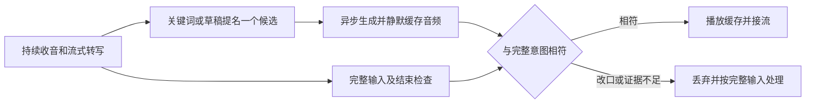

# UX166：提前备答与完整输入

2026-09-29。用户提出边听边推测意图、提前取得响应包。当前实验路径已经采用
ASR 草稿提名、异步生成、静默缓存、最终输入核对；本轮核对了这一机制的输入前提。
只扩展问句续说提示的 204 实验没有改善完整输入，已撤回。源码及正常构建回到
203，保留其 L2 接收修复；设备恢复 0.11.72-summary。整体目标仍未完成。

## 交互机制

关键词只用于准备。GPIO、记忆写入等动作仍由完整最终输入和工具校验授权。
不能把用户说“蓝色”时的猜测，当作其后说“不对，绿色”的最终指令。已经播出的
错误答案不能靠后续引导撤回，因此核对发生在开始播放前。

本机同时最多准备一份候选，不增加并行云请求数量、缓存容量或任务。连接预热、
临时转写、候选首 PCM、接话、有效回答各有独立事件。预取仍是实验开关，当前
恢复的 72 设备预取关闭，不能把实验源码能力写成已交付的正常模式。

## 固定输入诊断

先验证 203 的 407 份 C/H/CMake 与冻结包一致。使用已冻结 139 MODE2 USB 诊断
固件，在同一 C3 上重放三份已有 PCM，共 808 帧：401 帧一致性控制、241 帧完整
问题源、166 帧上轮实际设备片段。控制元数据逐字节一致；生产滤波相关源码一致，
source_stream 的差异仅为正常构建关闭的固定时长诊断分支。该过程未采集麦克风、
发起云请求或写入上下文。

完整问题“现在灯是什么颜色？请简单回答。”含约 930ms 句间低能量区间
（1880–2810ms，固定能量规则，并非人工音素标注）。当前生产端点在数字源的
2580ms 结束。只给同一文本增加已有 PHRASE 标志后，结束位置为 4800ms。
这里的数字源提示时刻是明确设置的反事实条件，不能当作实时 ASR 到达证据。

上轮板上片段重放得到 3280ms 结束，speech_ms=640、dense_ms=2580，与当时统计
相符；按实际事件墙钟相对 record_at 重放新词汇规则后，片段 EOF 时尚未结束。
但它只有 3.32 秒，EOF 后的麦克风数据未知，不能由此声称后半句必然能识别。
该通知时钟也不是逐帧记录的消费者时钟。401 帧控制的旧、新策略结果一致。

## 唯一策略变更和检查

204 只将现有问句续说规则扩到“什么、什麼、甚麼、乜嘢、咩”；保留自我介绍排除、
700ms 基础结束静音、每轮累计 400ms PHRASE 额度及原 1000ms 共用上限。
没有新状态、缓冲、阈值或候选权限。没有后续句子的这类问句可能多等最多 400ms，
不能把这个取舍称为端点提速。

70 项 ASan/UBSan 主机检查通过，45.75 秒，新增覆盖问句跨约 930ms 停顿、累计
额度及普通短命令不受影响。正常、关闭音频构建通过：1501888B、1013968B；
正常应用比 203 增加 32B。源码审计只有词汇、对应测试和版本三份文件变化。
首次主机构建命令没有指定已安装 CMake 的绝对路径而失败，改用既有路径后通过，
失败日志保留。没有修改主机环境或借此补算测试成绩。

## 唯一一组连续三轮

正常 204、idle 预连接、prefetch/reuse 开启；固定同一输入 WAV、增益 0.25，
普通话/粤语/普通话唤醒，业务文本为普通话。轮间不关闭 voice、不等待预连接，
不导出录音，不追加失败补轮。三次均首次唤醒并到 @done，无观察到的复位、WDT、
panic 或 DMA 丢失；三次最终转写均只有“现在灯是什么颜色？”，完整输入 **0/3**。

|轮次|候选结果|首候选 PCM 相对上传结束|接话提交相对上传结束|正式首 PCM 相对上传结束|
|---|---|---:|---:|---:|
|1|正常，正式请求并行|提前 464ms|343ms|5007ms|
|2|原 500ms 等待到期取消|晚 790ms|未播放|4211ms|
|3|正常，正式请求并行|提前 685ms|295ms|6109ms|

这些是设备事件，不是用户词尾到耳边声音的时间。候选 1、3 提名早于上传结束
1534、1529ms；提前生成可以运行，不等于已取得正确完整输入或一秒有效回答。
第二轮只收到 1566 样本，首消息未收完即取消，与 203 已修复的 HTTP/WS 并行
接收停顿不同。原生成/等待期限保持不变。

末轮确实消费了 400ms 额度，quiet_ms=1100，端点 source_ms=3660，录音 3.688 秒。
组后导出的片段样本数与最后 wake 状态一致，本地 SenseVoice 也只识别到核心问题；
原输入则识别出完整两句。这说明单独增加问句提示没有解决此次麦克风输入截断，
不再叠加更长固定等待来试分数。

SDK 最低堆 43968B，低于 49152B 要求。48.65 秒外录保存，固定波形对齐未通过，
声学回答起点继续记为 unknown，没有放松门槛。自动 ASR 不是主观试听结果。
两组都是小样本历史对照，不能从 PCM 时序计算确定的体验提速比例。

## 撤回、保存与下一步

因完整输入仍 0/3，按预定条件撤回三份改动文件；407 份生产及测试 C/H/CMake
再次与 203 冻结源码逐字节一致。重建正常 203 后应用也与原冻结包一致：
1501856B，SHA256 `00be0038403e66183e69c167d01d565bc78f0173be96e88f157ffca27852314e`。
204 及失败实验单独保留，未推广默认安装包。

所有烧录通过完整 4MiB 备份、应用读回、非应用区一致性检查。上下文由 1279 条/
1033668B 增至 1285 条/1036356B，新增六条和持久化序号在恢复 72 后保持。
2MiB 分区、204800B 历史预算、448KiB 录音分区未变。当前活动日志区仅余 12220B，
后续实验应先核对存储，不擅自删除用户历史。设备恢复联网、fast/capture 监听、
reuse 开、prefetch 关、灯灭；电脑采集停止，COM5 释放。

下一步应围绕实际麦克风中续说开头的检测与候选完整回答路径收敛，避免重复问句
词汇或固定静音时长扫描。保留边听边准备、完整意图决定采用的方向；接话提前、
正式回答提速及完整输入分别验收。

证据：`artifacts/voice-fast/predictive-input-ux166/` 的计划、板上重放、配对策略分析、
主机/构建日志、comparison.json、timings.csv、三轮原始串口与音频、输入复核和关闭审计。
204 应用 SHA256：`5ca08b499d6fc1b7efd3de445314139ab65cba98c950be7ab1f6fc8c10b00cee`。
