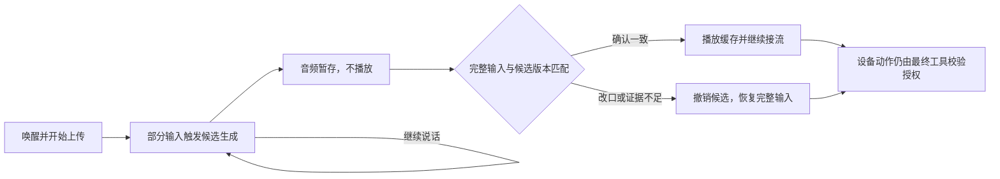

# 边听边准备回复：协议验证与设备接入约束

2026-09-26。用户希望设备像人一样在听话时判断意图，提前准备回复和音频。
单连接电脑实验及C实现主机检查已通过；0.11.48–59已做有界实机试验，整体未通过。
当前设备为0.11.72，fast/capture监听、连接复用开启、预取关闭，详见
[摘要与接话报告](VOICE_SUMMARY_HANDOFF_REPORT.md)及[改口保护报告](VOICE_CLARIFICATION_REPORT.md)。下文回滚记录都是当时快照。源码保留
可关闭的实验路径，本文件不代表一秒回复、完整产品交付或主观听感验收。

## 采用的流程

唤醒后立即建立千问连接并持续上传。短暂停顿可以触发一次可丢弃的草稿，
网络继续接收后续语音，生成的音频只进入静默缓存。每个输入段、回复和缓存
绑定同一代号。后续语音开始时，旧代号立即失效；最新完整转写和本地收音
结束同时确认后，才允许采用对应的新回复。取消、否定和改口必须覆盖旧草稿。

这把部分模型生成和音频下载提前到收音期间，能够减少结束后的等待。
关键词可用于准备路由、查找本地提示音和预热连接，但关键词一致不足以判断
完整意图一致，例如“蓝色”和“不要蓝色”。不允许给已经开始播放的旧答案
追加一句引导，就声称其旧内容已被撤回。硬件动作始终要求最终输入和原工具校验。

本次验证的是短暂停顿驱动的提前生成，并非任意半句话都能立即触发推理，
也没有提前并行发起DeepSeek请求。接话、结束咻音和有效回答分别计时。



## 官方接口依据

- [Omni Realtime Python SDK](https://help.aliyun.com/en/model-studio/omni-realtime-python-sdk)：手动模式生成回复时应停止发送音频；VAD模式允许继续发送并打断生成。因此不能直接在现有手动模式中提前commit，同时声称后续音频仍完整进入同一轮。
- [客户端事件](https://help.aliyun.com/zh/model-studio/client-events)：server_vad可配置200ms静音时间，并自动提交、触发回复；仅在响应进行中取消，避免对不存在的生成发送取消请求。
- [服务端事件](https://help.aliyun.com/zh/model-studio/server-events)：中间text为确认前缀，stash仍可修改；最终completed事件才是该输入项的完整转写。

本实验没有依赖未经核实的out-of-band文本生成参数、第二条TLS连接或新的模型。

## 已执行的有限实验

`tools/voice/prefetch_probe.py`使用已有合成WAV，三个独立电脑会话、每个一次，
同一模型`qwen3.5-omni-flash-realtime`、Tina、server_vad200ms。工具列表为空，
不采集麦克风、不播放、不执行灯控。继续上传全部文件和尾部静音；旧的
`omni_endpoint_probe.py`默认行为不变，新增`--continue-input`仅用于此诊断。

| 输入 | 服务端输入段数 | 作废回复数 | 最后有效回复首PCM相对原输入文件末尾 |
|---|---:|---:|---:|
| 自我介绍 | 1 | 0 | +566ms |
| 设置蓝灯，简单回答 | 2 | 1 | +527ms |
| 蓝灯，随后改成绿灯 | 4 | 3 | +455ms |

改口实验中，蓝色草稿已在4.234秒收到PCM，最终缓存145920B；5.031秒新的
绿色输入段开始后它被作废。最后一个回复保留绿色，全部输入转写包含蓝色、
绿色及两次“请简单回答”。旧音频没有播放，设备灯也没有改变。

三组最终PCM均早于“文件末尾再加700ms”的假设门槛。但该门槛不是实物VAD
时间，文件含前后静音，拼接时还加入600ms间隔。因此不能据此声称设备一定
保留了这次改口、真人停顿不会截句、或者扬声器在455ms开始回答。当前也没有
证明在不含停顿的长句结束前，最终有效音频已经下载完成。

证据：`artifacts/voice-fast/prefetch-protocol-01/`。原始`report.json`和三份
`events.jsonl`保持原样。`revision-audit-02.json`根据已提交的输入item_id绑定
response_id重新分析；不能只把response.created归给当时最新的speech_started，
因为旧输入的生成事件可能晚于新输入到达。审计包含原报告、事件和分析器哈希。
五项离线Python测试通过，覆盖延迟旧生成、改口、旧包、取消、缺失最终ASR、
重复或未知身份。固定素材的精确转写/颜色检查不是通用语义验证器。

## 设备接入前必须完成的工作

1. 单连接C协议解析增加有界输入版本与response_id关联；保持完整上传，不在
   第一个云端endpoint停止。取消旧生成是正常结果，不将旧包交给播放器。
   缺少身份、顺序有歧义、超出段数或文本上限时回退，不能猜测对应关系。
2. 将预响应缓存与录音内存分开。现有fast路径录音期间借用engine的消息、
   reply和SSE区域；`audio_scratch_release`还会清理该区域。现有
   `esp_hi_stream_cache_begin`只允许录音结束后使用96KiB录音槽尾部，不能简单
   删除检查并让两个任务同时使用旧缓冲。需要明确所有权、保留范围和取消回收。
3. 缓存每次替换要校验代号和完整性；Flash擦除不得阻断ADC造成丢帧。先验证
   录音与静默缓存并发的CPU、堆和栈，再决定缓存大小与分批写入方式。不减少
   2MiB上下文、200KiB历史预算或448KiB录音槽，不额外常驻第二套大PCM缓冲。
4. 只有本地成功结束、完整最终ASR齐全、最新回复身份匹配且未取消，才能提交
   音频。普通回答、未来式过程语和工具成功确认分别处理；草稿不得授权GPIO，
   不把“准备设置”替换成虚假的“已经设置”。不合格草稿丢弃后走原完整流程。
5. 主机测试通过后，先做三轮连续设备对话，再做含改口/否定/句中停顿的三轮，
   分别保存输入完整性、缓存命中/作废、首有效声音与资源数据。有限验证出现
   ADC丢帧、错误播放或内存冲突即关闭预取，保留可回滚的0.11.47，不开无限调参。

当前应用1537904B，物理应用槽剩34960B，项目应用软上限仅剩2192B；板上累计
最低堆40920B，尚低于48KiB目标。上述设备接入预算还未实测，不能将电脑实验
的内存占用或云端首PCM时间直接当作C3能力。

## 0.11.48 实现及烧录前检查

新增独立的 `draft.c` / `prefetch.c`，使用40KiB临时IMA ADPCM缓存，最多约3.41秒
24kHz音频。缓存借用fast录音时已释放的TEN工作区前部，录音元数据、WS缓冲和
结束后4KiB播放环各自有边界。保留capture handoff期间所有权，缓存读者结束后才
允许消息和历史序列化覆盖该区域。上传过程不写猜测音频到Flash，也不新增40KiB堆。

最多8段输入、16个响应身份、512B候选文字。后续语音立即作废旧候选；最终输入
逐段保留，身份有歧义或最终转写不齐时不能播旧答案。普通回答在完整输入被接受后
可从缓存前缀接到网络流，避免等待整段生成；设备任务的未来式接话仍完整校验。
超长候选当缓存未命中回退，不截断播放。只有原有完整意图及工具校验可操作硬件。

开关为 `agent voice prefetch on|off`，需先关闭voice；重启默认off。原fast/classic
路径保留。42项主机检查通过，包含缓存、随机分块、改口、延迟旧响应、最终ASR、
取消及前缀接流测试；三份真实协议记录恢复PCM后用C实现离线重放通过。
该重放重构了JSON，因此不证明原始线上JSON字段顺序。证据分别为
`test-prefetch-stream-01.log`、`prefetch-c-replay-02/`。

仅应用控制和协议代码开启LTO；采集ISR与逐样本DSP保留原编译方式，厂商库不变。
正常及无音频构建通过。候选应用1540048B，固定槽剩32816B，距原软上限仅48B；
没有放宽烧录保护或缩小数据分区。最终实机资源/时序/录音验证尚待完成。
录音结束咻音也调整到DAC启动20ms后插入，原200ms预热总量保持，尚未实测。

## 复现

以下命令都在项目根目录运行，输出目录必须不存在；不自动重试云端调用。

```powershell
# 不联网，准备三份输入与配置
.\.toolchains\tools\python_env\idf6.1_py3.11_env\Scripts\python.exe -X utf8 tools/voice/prefetch_probe.py --out artifacts/voice-fast/prefetch-new-plan
# 一次有限协议测试，沿用本机凭据读取机制
.\.local\tts-python\Scripts\python.exe -X utf8 tools/voice/prefetch_probe.py --out artifacts/voice-fast/prefetch-new-run --execute
# 不联网的分析器回归
.\.toolchains\tools\python_env\idf6.1_py3.11_env\Scripts\python.exe -X utf8 host_tests/test_prefetch_probe.py
```

原始生成音频、凭据、构建和备份继续不进入Git。正式0.9.0安装包与M0验收
状态不因本实验而变化。

## 0.11.49 实机结论：证明了提前缓存，尚未改善整轮体验

0.11.48首组三轮均有完整云端转写，却因结束时刻校核超时；失败记录保持原样。
0.11.49复用已有 `asr_end` 的源时间及本地续说保护，加入700ms源音频停顿窗口，
完整ASR关联对应输入序号。新语音或本地重新起音作废候选。该保护可协助结束
被噪声拖长的录音；也可在录音后对当前序号给出资格证明。没有直接删除校核。
当前 `verify.local_end` 仍会在fast辅助结束后为true，不能据此断言完全由本地VAD结束。

三组均连续zh/yue/zh唤醒、普通话业务文本，不在轮间重启监听或等待fast_ready。
保留所有失败，不以收到云端转写或提示音算作完成。

| 0.11.49实测组 | 首次唤醒 | 完整对话 | 结果 |
|---|---:|---:|---|
| 开启预取，自我介绍 | 3/3 | 2/3 | 首轮超时；后两轮从缓存接流播放 |
| 开启预取，蓝→否定蓝→绿 | 3/3 | 0/3 | 三轮采集中协议错误，未播放猜测、未执行灯控 |
| 关闭预取，自我介绍 | 3/3 | 1/3 | 两轮原有本地收音达到上限，保留失败 |

成功的两次预取，首PCM分别在本地 `vad_end` 前756/834ms到达；
`vad_end` 到送入播放器均8ms，到板上扬声器启动182/181ms。
但外置麦克风相对测试输入词尾的回答候选时间为 **3.563/3.097秒**，
并未达到一秒。独立本机ASR识别到自我介绍内容，存在“小言”同音字误识别；
该分析不是主观试听，也不是首个有效音素的精确标注。原fast成功一轮对应
611ms送入播放器、外录1.948秒。不同成功率及小样本不支持总体提速结论。

无DMA丢样或复位；0.11.49累计最低堆34452B，仍低于48KiB。0.11.48曾降至29544B。
接收端增加有界非阻塞读取，缓存仍40KiB借用内存；并发处理的资源代价尚未达标。
改口故障的具体事件尚未定位，不能宣称已通过真实设备的改口保护验收。

应用1539104B，软上限余992B；ADC中断计数回调独立在非LTO `audio_irq.c`，
链接地址0x40381f08、58B；其12B上下文位于DRAM0x3fc941ec。其余应用任务
控制使用LTO，逐样本DSP及厂商库编译方式不变。42/42主机检查及无音频构建通过。

代码和可编译源码包保留在 `candidate-0.11.49`，accepted=false；正式包未更新。
0.11.49应用SHA256：`96a9c7d784c8290cbe85a8ac7dc83b90d864c29b194e2dcc610697490deeee1f`。
实物回滚0.11.47时完整备份、应用读回及非应用分区逐字节一致性再次通过。
Wi-Fi、Key、2MiB上下文、200KiB历史预算及448KiB录音分区没有缩减。

证据目录（均在 `artifacts/voice-fast/`）：`prefetch-01148-greeting-01`、
`prefetch-01149-greeting-01`、`prefetch-01149-correction-01`、
`prefetch-01149-off-greeting-01`。每组保存原串口、配置、外录、失败和离线分析。
修复前缀接流及结束确认测试见 `test-prefetch-fence-03.log`；
最终构建见 `build-prefetch-fence-05.log` / `build-prefetch-fence-noaudio-02.log`。

下一次工程门槛是先定位并用真实协议记录重现改口事件错误，再验证录音收尾和
双向传输的资源预算。未跨过这些门槛，不能默认开启，也不启动更多大规模循环。

回滚后的独立三轮对照 `prefetch-rollback-01147-greeting-01`：首次唤醒3/3，
完整对话1/3，另外两轮也是录音超时；成功一轮VAD→PCM587ms、外录1.711秒。
因此不能把关闭预取后的收音超时归因于新增代码。旧版同样观察到29828B累计
最低堆，低堆问题也未被本轮隔离归因。当前恢复状态保存在
`prefetch-restored-01147-01/status.json`：fast/capture/listening、无任务、灯关闭、
空闲堆71952B；上下文1091事件/1016644B，历史预算204800B。串口已释放，
电脑测试录音器已停止。与0.11.49冻结源码逐项比较，314份C/H/CMake文件一致。

## 0.11.50/51：空转写诊断与完整输入恢复

0.11.50只增加错误元数据记录。实机三轮连续改口的前两轮明确收到
`transcript:""`，输入ID与已提交项一致；空字符串本身是服务端可返回的
情况，不能当作格式损坏，也不能证明该段没有用户说话。
[官方转写排查说明](https://help.aliyun.com/zh/model-studio/realtime)亦要求
检查空转写与VAD分段；本项目的具体原因以保存的实机事件为依据。
第三轮录音结束时本地`quiet_ms=0`，设备录音的离线转写为“请把灯调成蓝色不对”，
云端只识别“调成蓝”；播出了过时的蓝色准备话语，没有执行灯控。
不能将这种部分回复算作快速成功。外录第三份输入未通过波形匹配，延迟不评级。

0.11.51采取两项修复：

- 保留空转写对应的已提交输入段，继续上传后续语音，同时永久标记本轮猜测
  不具备采用资格。成功结束并提交本地录音后，关闭旧连接，只做一次完整
  录音的手动识别恢复，沿用现有最终输入及工具校验。恢复失败、取消、读盘
  错误不会播放旧草稿，也不会继续递归重试；这一条会牺牲速度。
- 对fast模式记录连续人声的最后源时刻。若它晚于候选云端结束点，候选不能
  终止收音；这补上了原来只在300ms停顿后检测“重新起音”的漏洞。
  原classic模式的hold0规则未改。停止音效与有意义的回答仍分别计时。

42项ASan/UBSan主机检查通过，包括空最终转写、后续改口、重复及改变的最终
转写、一次恢复、恢复时取消/读盘错误/再次空转写，以及未出现停顿的连续人声。
真实云端106个事件在C端重放：4个输入版本、3份作废缓存、最终包含全部改口
且回复绿色。重放明确`protocol_only=1,input_ready=0,playback_authorized=0`；
保存的电脑文件没有设备本地结束证据，不能冒充可播放的实机验收。

候选0.11.51应用1540048B，距不变的软上限仅48B；分区、上下文和历史预算
均未缩减。应用SHA256为
`97a80c85e85a7304fc38f15a681022302a3d32293cf60d49d1a40c4dde1919aa`。
原始诊断组：`prefetch-01150-correction-01`；完整录音和离线核对：
`prefetch-01150-correction-clip-01`、`prefetch-01150-signal-review-01.json`。
修复候选与源码：`candidate-0.11.51`，accepted=false；正式安装包不更新。

### 0.11.52回归结果（未通过）

每组均连续普通话/粤语/普通话唤醒，不在轮间重启或等连接准备完。

| 候选 | 首次唤醒 | 完整改口对话 | 失败 |
|---|---:|---:|---|
| 0.11.50诊断 | 3/3 | 0/3 | 2次空转写协议错误；1次截断、过时蓝色准备话语 |
| 0.11.51完整输入恢复 | 3/3 | 1/3 | 2次音频结束类协议错误 |
| 0.11.52取消回复尾事件处理 | 3/3 | 0/3 | 2次音频结束类协议错误；1次输入覆盖超时 |

0.11.51唯一完整一轮保留“蓝→不对→不要蓝→绿”的全部转写，只执行
`r=0,g=255,b=0`。设备最终回答在VAD后约11.02秒开始，独立离线ASR
识别为“好，已经改成绿色了，没有用蓝色”。外录输入波形门槛不通过，
没有端到端声学速度成绩。这证明了单次恢复闭环，不是可靠性或速度验收。

0.11.52仅丢弃精确匹配最近取消回复ID的`audio.done`和`audio_transcript.done`，
不触发回调、音频或工具；未知ID及迟到音频仍拒绝。单元测试涵盖新响应前后
出现的旧标记，但实机错误仍在，不能宣称已修复全部服务端事件顺序问题。
现有串口只保留被拒事件类型，下一次应先在一次诊断中保留响应ID、活动状态、
PCM奇偶状态及对应原始元数据；没有这些证据前不再放宽解析器。
0.11.52应用1540064B，软上限余32B，SHA256为
`8d8aa16e15d7be3dd6266d5a4d5f9f48feba78b04d8651c9a0dee34f669cfc75`。
音频和关闭音频构建、42项主机检查、三份原始真实协议重放通过。
三组最低堆分别38144/32728/30956B，均未达到48KiB；DMA丢失均0。
没有追加问候性能组或大量循环，也没有减小上下文预算。

所有候选保留可编译源码；正式包不变。汇总：
`artifacts/voice-fast/prefetch-correction-summary-01.json`；各组原录音、
完整串口、离线分析及失败保留在对应`prefetch-01150/51/52-correction-01`目录。
本轮目标分类为有实质进展：定位空转写和连续说话截断，新增有界恢复及回归；
整体完成条件仍未满足。稳定一秒、连续三轮、完整收音和最低堆继续开放，
不会依据缓存提前命中、提示音或一次恢复成功标记完成。

## 0.11.53–55：采集独立于猜测，失败草稿隔离

0.11.53的两组连续改口完整成功2/3、1/3。第二组抓到实际服务端
`response.audio.done`不含`response_id`，且发生在首个`response.created`
之前。因此0.11.52的“最近取消ID”处理无法覆盖这个事件。0.11.54只把
连续模式的`audio.done`、`audio_transcript.done`作为无状态的结束标记丢弃；
它们不进入回调、不产生音频、不授权动作。音频/文本增量和最终`response.done`
仍校验当前响应身份，最终结果、PCM奇偶和输入完整性仍须通过。

0.11.54遇到预测连接的协议错误时，关闭连接、撤销旧结束点，继续收完本地
录音。只有采集成功且尚未发声或执行动作，才恢复一次完整录音识别；取消、
存储或麦克风错误仍终止。上传统计保留实际接受的前缀样本数、CRC和
`complete:false`，不会把本地录完冒充网络全部上传。实机两次改口确实走过
此路径，后半句仍完整，最终只设置绿色。剩余`content_part.done`和最终ASR
事件仍有被拒情况，不能宣称全部协议顺序问题已消除。

每组3轮，普通话/粤语/普通话唤醒、普通话业务句；轮间不重新启用监听，
不等待`fast_ready`。全部原始输入、外录、串口和失败保留。

| 0.11.54测试组 | 首次唤醒 | 完整文本和任务 | 最终回答外录候选延迟 |
|---|---:|---:|---|
| 预取开启，蓝→不要蓝→绿 | 3/3 | 3/3，仅执行绿色 | 14.053 / 11.892 / 12.444秒 |
| 预取开启，自我介绍 | 3/3 | 3/3 | 7.636 / 10.170 / 9.423秒 |
| 预取开启，记住灯名 | 3/3 | 2/3；任务3/3 | 15.566 / 13.409 / 15.094秒 |
| 同固件关闭预取，自我介绍 | 3/3 | 0/3，均收音超时 | 无有效回答 |

记忆第3轮漏转写“我”字，仍按既定完整文本规则记失败，没有放宽验收。
开启预取的9轮中7轮恢复完整录音；另外2轮最终草稿未通过准备话语校验，
交给普通后台路径，没有缓存播放命中。问候三轮ASR段本身完整，但云端结束点
后本地仍有较长录音，完整输入门槛未通过；先等待2.5秒再整段恢复，导致变慢。
是否为尾部噪声、源时刻偏差或其他收音问题，尚未隔离。不能直接放宽校验。

外录均有波形匹配，独立本地ASR识别出最终内容；这些是信号检测的候选时间，
未进行真人听感验收，也不是精确音素标注。全部咻音频谱门槛未通过，不能仅凭
固件时间戳认定提示音验收成功；恢复路径可能重复打开带提示音的播放流，保留
为下一步生命周期检查。三次“我来保存”过程语被外录ASR检出，但不计回答。
一次原生准备话语流有1次欠载；自然接话未通过。

0.11.54最小堆30572B，低于48KiB；12次首唤醒命中、DMA丢失0，没有观察到
复位。样本有限，不证明耐久或真人泛化。应用1540064B，正常上限1540096B，
未改变分区、2MiB上下文、200KiB历史预算或448KiB录音槽。
应用SHA256：`360822dd5aac0ea99a7a901d4cac7fb7651eab7045f9eb5d5d21a595b1290e3e`。

进一步审计发现：不合格草稿在`complete_ack_sentence`复制后被拒，但残留
`ack.text`仍可能被后台TTS复用；实机记忆第3轮出现“已给这盏灯取名”。
0.11.55在拒绝候选时清空该字段。新增实机原句、非将来式和不完整句三种测试，
先在54重现断言失败，再验证拒绝后不保留可播报文字、不执行动作、完整输入
仍交后台。55仅主机/构建验证，尚无实机验收；不把54数据归给55。

证据：`artifacts/voice-fast/prefetch-01154-summary-01.json`及四个同名前缀目录；
53两组在`prefetch-01153-correction-01/02`；原始模型事件和200→400ms单参数
对照在`prefetch-full-protocol-03`、`prefetch-full-protocol-400-01`。400ms仍分为
四段且缺词，固件未据此调大VAD。42项主机检查及音频/无音频构建通过54。

当前设备已恢复0.11.47-summary-source，fast/capture/listening、灯关闭，
恢复后空闲堆72456B（重启快照，不是工作负载最低值）。完整备份
`backups/kws-voice-flow-20260926-110924`，应用读回及非应用分区逐字节一致性通过；
状态`artifacts/voice-fast/prefetch-restored-01147-03/status.json`。电脑录音停止，
串口已释放。实验候选和源码保留，正式0.9.0安装包未更新。
本阶段有代码及证据进展；稳定一秒、完整收音、三轮完整记忆任务、自然接话和
资源门槛仍开放，目标未标记完成或受阻。

## 0.11.55–57：输入时间线、单次咻音与启动预热

55追加一组诊断三连问候：首唤醒3/3、完整输入及回答3/3，其中两轮恢复整段，
一轮缓存前缀接流。逐帧元数据CRC与生产C端点回放一致。前两轮云端结束点后
仍有本地密集人声判定，因此不能放宽旧结束点保护；这些判定还不能证明尾部
究竟是实际人声还是噪声。诊断元数据在录音后导出，本组不列入延迟验收。

56去掉“最新候选已经结束、却仍等待到超时”的额外等待。恢复前先保留完整
录音并启动提示音；已有提示音的流先收完，再复用缓冲，重连不重复播放咻音。
取消、存储错误和已经执行动作的情况不进入整段重试。未改变上下文和历史预算。

| 56连续测试 | 首次唤醒 | 完整输入＋任务 | 最终有效回答外录候选延迟 |
|---|---:|---:|---|
| 自我介绍 | 3/3 | 3/3 | 8.095 / 7.000 / 6.926秒 |
| 蓝色→不要蓝色→绿色 | 3/3 | 3/3，仅执行绿色 | 整组波形匹配失败，不报速度 |
| 记住灯名 | 3/3 | 1/3；任务3/3 | 11.742 / 12.694秒；第三轮匹配失败 |

记忆前两轮转写漏词，仍记失败；其被拒草稿没有进入备用TTS，两次“我来保存”
过程语由外录ASR独立检出。问候VAD到恢复422/1503/2552ms，到实际DMA首回答
3809/4320/5549ms。小样本、非随机顺序且网络不同，不宣称固定提速比例。
问候与改口六轮都恢复完整录音，预取命中仍不稳定。

56累计最低堆22112B，低于48KiB目标；DMA丢失0，未观察到复位。应用1540048B，
正常上限1540096B，未缩小2MiB上下文、200KiB历史或448KiB录音槽。42项主机
检查和音频/无音频构建通过，候选不予发布。汇总为
`artifacts/voice-fast/prefetch-01156-summary-01.json`，每一失败行都保留。

六次可定位的提示音均未通过原频谱门槛。与保留的47实录对照，56音效前约100ms
是静音，只剩后半段低频扫音；47则有完整扫频。这与48将启动零电平从200ms
提前到20ms的变化一致。57恢复原200ms启动预热，保留56的单次提示音机制，
网络仍并行。音量、频率、检测阈值、模型与输入完整性标准均不变。
对照图和分析脚本为`prefetch-cue-warmup-review-01.png`、`review_cue_warmup_56.py`。
57三连问候已完成：首次唤醒3/3、完整输入及回答3/3，原频谱门槛3/3通过，
每个扫频匹配分数均1.0，提示音仅一次；本地VAD结束到cue起始均172ms。
第一、三轮仍恢复整段，外录有效回答候选6.563/7.234秒；第二轮命中缓存前缀
并继续接流，VAD到首PCM363ms、到DMA422ms，外录候选1.624秒。
这些时基分别保留，不能以363ms宣称端到端一秒。录音裁剪为排除咻音而使用
保守余量，第二轮初始ASR只识别到“小言”；以实录扫频尾部＋10ms起另取片段，
独立ASR得到完整“我是小言，一个简洁高效的智能助手”。原延迟结果不修改，
仍是候选时间而非精确首音素或真人听感。证据`prefetch-01157-greeting-01`的
`report.json`、`offline-analysis.json`、`feedback-analysis.json`和`prefix-audit.json`。

57最低堆43048B，仍低于48KiB，DMA丢失0。应用1540048B，SHA256为
`3a4ae87495ab9d6efcf05186172633ee9f4f94bd07ee6b2feb716db2125dac00`。
音频/无音频构建和42项主机检查通过；仅一次三轮验证，不扩大调参。
56/57源码、应用及完整备份保留，均accepted=false；正式0.9.0安装包未更新。

最终实物恢复0.11.47-summary-source，fast/capture/listening、灯关闭、预取关闭。
完整备份`backups/kws-voice-flow-20260926-115121`；应用读回及非应用分区一致性
通过。状态在`artifacts/voice-fast/prefetch-restored-01147-04/status.json`。
最低堆72308B是恢复后快照，不能替代上述测试最低值；电脑采集已停止，COM5
已释放。本阶段有代码、故障定位和实机进展，整体目标继续active；稳定一秒、
可靠完整收音、自然接话与资源门槛仍未通过。

## 0.11.58–60：分片读取、九轮完整输入与真实重叠审计

59增加无堆分配的C11 WebSocket读取器。跨调用保存未收完的帧头和控制帧，
普通负载直接进入原有缓冲；每次最多两步帧头和一步负载读取，仅第一步可等待。
TLS读暂时使用非阻塞套接字，写入前恢复原标志。控制帧只在完整接收后处理，
保留长度、掩码、操作码、分片及取消检查，不增加第二连接或音频缓存。
`rd/rd0`现在统计底层TLS读取，`rx`仍是完整适配器调用；墙钟耗时包含任务抢占，
不能把指标变化直接等同于网络性能变化。

58曾烧录但未进行对话测试：集成复核发现HTTP升级后SDK可能保留WebSocket字节，
直接读取TLS会跳过它们。58已撤回，未当作通过。59先沿用SDK读完完整帧，直到
一次空轮询证明SDK缓冲耗尽，再移交给增量读取器；启动阶段仍保留SDK读取行为。
原SDK源码未修改。新增分片、would-block、控制帧、断连和畸形输入测试，
43/43项ASan/UBSan检查通过；音频构建通过，无音频构建在58共同源代码上通过。

三组均使用连续普通话/粤语/普通话唤醒及普通话业务正文；轮间不切换voice，
不等待fast_ready。下列外录数值是输入播放结束到有效回答的信号/ASR候选，
不是精确首音素或人工听感，音效和过程话语不计入有效回答。

| 59连续测试 | 完整输入＋任务 | 候选接流 / 整段恢复 | 外录有效回答候选延迟 |
|---|---:|---:|---|
| 自我介绍 | 3/3 | 2 / 1 | 1.487 / 6.894 / 1.476秒 |
| 蓝色→不要蓝色→绿色 | 3/3，仅执行绿色 | 0 / 3 | 输入波形匹配失败，不报速度 |
| 记住灯名 | 3/3 | 0 / 3 | 15.162 / 16.205 / 15.505秒 |

首次唤醒9/9，DMA丢失0，未观察到复位。九轮均只有一次咻音事件；七次可独立
定位的外录咻音通过原频谱门槛，另两次匹配不足，保持未知。三个“我来保存”
过程提示均由本地ASR检出，但后台最终回答仍慢，不能标记自然接话通过。
改口第一轮在`response.done`取消事件后转为本地收音；第三轮恢复响应又拒绝
`response.audio_transcript.delta`。记忆第二轮在`response.content_part.done`后
转为本地收音。输入均通过一次完整录音恢复，协议故障仍存在，未放宽归属校验。

两次“hit”必须与真正的提前备好音频区分：各缓存仅309样本，首PCM分别在本地
收音结束后383和534ms才到达，且可能包含起始静音。它们证明候选前缀能衔接
实时流，**不证明用户说完之前已准备好有效回答**。九次冷连接到ready耗时
1787–2005ms，短句的大部分采集时间已被连接占用。进一步工作应先检查安全复用
连接及取消事件状态；现有idle预连接会暂停唤醒监听，不能直接开启后宣称解决。
没有通过放宽输入覆盖检查来制造命中，也没有再次扩大阈值搜索或测试次数。

问候读取器`rd0`最大值3/9/3ms，改口75/93/86ms，记忆22/88/87ms，仍有长尾。
前后版本不是随机对照，且旧`rd0`定义不同，不计算固定提速比例。累计最低堆
28544B，低于48KiB门槛。上下文2MiB、历史预算200KiB、录音槽448KiB均未缩减。

59应用1540992B，比正常1540096B上限大896B，只在已有额外1KiB的有限协议诊断
许可内烧录；未提高正常预算。应用SHA256：
`930f6235dd03ad54c5d29be2a6204409abb1c6c23a3d735190543a71ee3088f2`。
60尝试只把四个协议源文件改为`-Oz`，43项主机检查仍通过，但应用增至1541104B，
故未烧录并撤回。失败应用、以59源码为基础的准确两文件差异和日志均保留。
恢复59源码后312个C/H及构建文件与冻结包逐字节相同，重新构建应用也与59哈希相同。

证据在`artifacts/voice-fast/`：

- `prefetch-01159-summary-01.json`保留全部九轮，波形匹配失败不会丢行。
- `prefetch-01159-overlap-01.json`区分缓存路径命中和真正的收音前音频。
- `prefetch-01159-{greeting,correction,remember}-01/`保留原串口、外录、哈希及离线分析。
- `candidate-0.11.59/`、`candidate-0.11.60-withdrawn/`及相关构建/测试日志。

诊断结束后按正常上限回滚0.11.47：完整备份
`backups/kws-voice-flow-20260926-122720`，应用读回及所有非应用分区逐字节一致性通过；
恢复后的整片SHA256为
`583a44cd1a02720a54a2f817430f2ae419a94f8a63e95e4267ebc54a76c0fb62`。
`prefetch-restored-01147-05/status.json`确认fast/capture/listening、灯关闭、Wi-Fi在线。
恢复后72448B最低堆只是重启快照，不替代工作负载结果。电脑录音停止，COM5释放，
正式0.9.0安装包未改变。本阶段有实现和可复查证据进展，整体目标继续active；
稳定一秒、提前有效音频、取消事件、低堆和自然接话仍开放，不标记完成或受阻。
