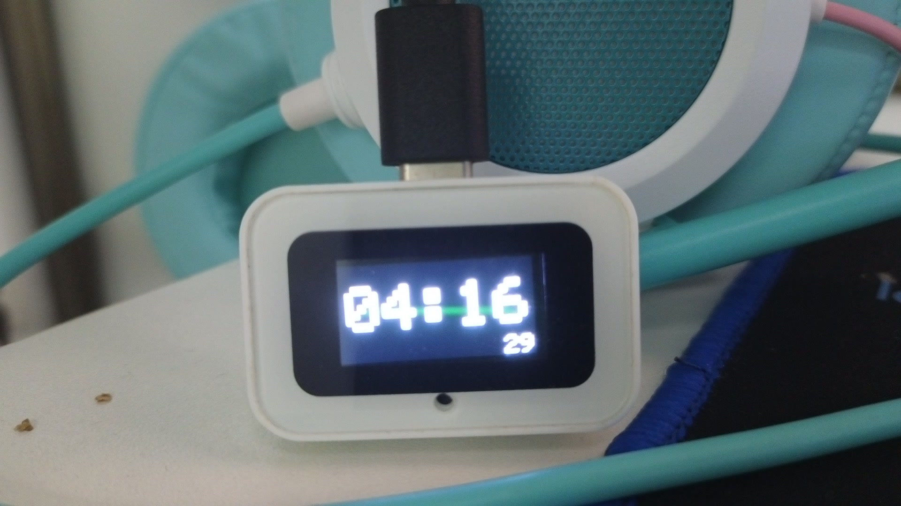

# 0.12.4-clock 实物与设备证据

2026-10-10，ESP-HI / ESP32-C3。照片为 Insta360 Link 的原始 JPEG，未经裁剪或重绘。USB 接头朝上，大字为北京时间 24 小时 HH:MM，右下小字为 SS。

| 照片 | 实际读数 |
|---|---|
| boot.jpg | 04:16，右下 09 |
| sample-0.jpg 至 sample-5.jpg | 04:16，右下依次 11、13、15、17、19、21 |
| reboot.jpg | 软件重启自动恢复，04:16，右下 29 |

device-test.json 保存采集时间和照片 SHA-256；visual-observation.json 是助手逐张目视评估，未冒充用户人工确认。固件自身不具备视觉反馈，因此其 visual_verified=false 与独立摄像头验收 PASS 并不矛盾。

flash-verification.json 保存仅应用烧录、读回及非应用分区保持结果；usb-request-verification.json 和 codex-relay.json 保存设备请求到当前 Codex 聊天的验证。JSON 是公开副本，凭据字段由导出脚本移除；原始文件保留本机。

完整过程见 [LCD 修复报告](../../CLOCK_LCD_REPAIR_REPORT.md)。
