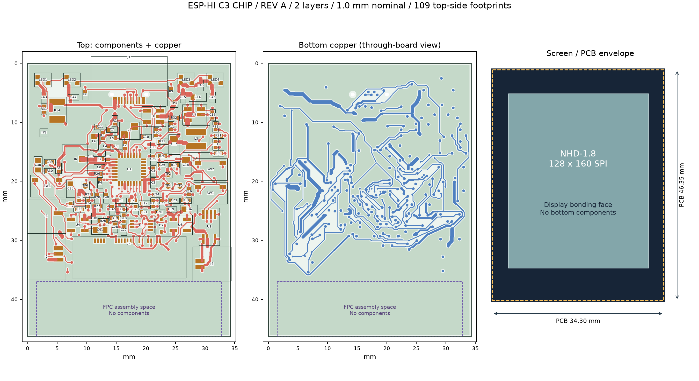

# ESP-HI 裸芯片版 Rev A

**原理图与两层 PCB 已完成，CAD 检查通过；这是待实板验证的样板设计。**

用 ESP32-C3FH4X 裸芯片替代 ESP-HI 模组，保留现有外设 GPIO 分配。屏幕选用 **Newhaven NHD-1.8-128160EF-SSXN-F，1.8 英寸、128×160、ILI9163V、SPI**。PCB 为 **34.30×46.35 mm、标称 1.0 mm、两层 1 oz 铜**，小于屏幕 34.70×46.75 mm 的外形。所有元器件和连接器在顶面，底面贴屏；24 针 FPC 绕至顶面。麦克风、扬声器均使用 JST SH 卧贴座。

## 打开和查看

| 文件 | 用途 |
| --- | --- |
| [立创专业版原生工程](native/ESP-HI-C3-RevA/ESP-HI-C3-RevA.eprj3) | 下载整个 `native/ESP-HI-C3-RevA` 目录后打开；符号、封装、7 页原理图及 PCB 均可编辑 |
| [原理图 PDF](exports/ESP-HI-C3-RevA-schematic.pdf) | 7 页原理图，保留器件值与网络名 |
| [PCB 布局 PDF](exports/ESP-HI-C3-RevA-board-review.pdf) | 顶面元器件、两面铜及屏幕外形 |
| [交互 BOM](exports/ESP-HI-C3-RevA-interactive-BOM.html) | 下载后在浏览器打开，可按位号定位；原始列表包含 DNP 和测试点，以装配 BOM 为准 |
| [装配 BOM](exports/ESP-HI-C3-RevA-BOM.csv) | 109 个封装位置：101 个实装器件、2 个 DNP、6 个裸铜测试点 |
| [实装贴片坐标](exports/ESP-HI-C3-RevA-placement-fitted.csv) | 排除 C12/C13 和 TP1–TP6；保持立创坐标与旋转定义 |
| [样板 Gerber](exports/ESP-HI-C3-RevA-fabrication.zip) | 保留原始制造图形，已剔除重复钻孔文件与辅助图层 |
| [原生 Gerber 完整导出](exports/ESP-HI-C3-RevA-prototype-gerber.zip) | 留作审计，包含辅助图层和重复的过孔钻孔文件 |
| [Gerber 图层复核 PDF](exports/ESP-HI-C3-RevA-Gerber-layer-review.pdf) | 从实际制造导出重新解析绘制 |

立创 EDA 专业版 4.1.71 已安装并完成官方激活。工程使用内嵌库，不需要单独的旧 `.elib` 文件。账号激活文件不在工程中。

## 已验证与待验证

- 立创原生 PCB DRC：**0 错误**；原理图 ERC：**0 错误**。
- 原理图和 PCB 各 **302/302 个有连接引脚**与设计网络表一致。
- 独立几何检查：**0 间距违规、0 未连接网络**；铜距板边、孔距、焊环及不同网络焊盘间距检查通过。
- 顶面 109 个封装位置、底面 0；只有两层铜；底面阻焊开窗 0。
- 尚未制造、焊接、上电、调谐射频或实际插接屏幕。详见 [验证报告](VALIDATION.md) 和 [装配与上电说明](ASSEMBLY.md)。

新屏幕需要独立的 128×160 ILI9163V 固件配置。仓库中已实测的 `0.12.4-clock` 仍对应原 ESP-HI 屏幕；本次没有改动或烧录现有设备。

## 设计记录

[规格与 GPIO 合同](SPEC.md) · [行动日志](ACTIONLOG.md) · [厂家资料和哈希](SOURCES.md) · [复核与再生成方式](scripts/README.md)

最终编辑来源是 `native/` 原生工程；`cad/` 和 `design-intent.json` 是生成与独立检查输入。不要把早期未布线的 Standard 中间文件当成制造版，也不要直接重跑生成器覆盖最终原生工程。
